## Докладчик

* Лемуш Мариу Франсишку
* Студент группы НПИбд-01-24
* Студ. билет 1032239162
* Российский университет дружбы народов

## Цель работы

- Получить практические навыки установки операционной системы на виртуальную машину
- Научиться настраивать минимально необходимые сервисы для дальнейшей работы

## Теоретическая справка

**Установка ОС Linux**

Основные этапы:
- Создание виртуальной машины
- Настройка параметров оборудования
- Установка дистрибутива
- Первоначальная настройка системы
- Установка дополнительного ПО

## Скачивание виртуальной машины

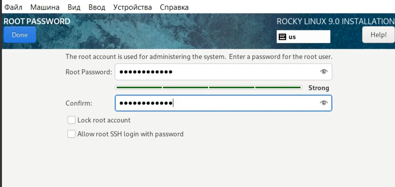

## Скачивание дистрибутива Linux Rocky

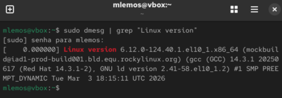

## Установка Linux версии Red Hat (64-bit)

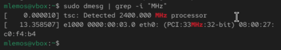

## Указание объёма памяти

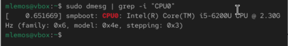

## Создание нового виртуального жёсткого диска
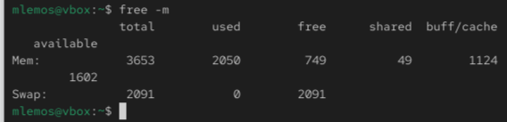

## Указание типа VDI

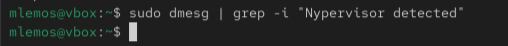

## Указание формата хранения

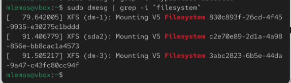

## Указание имени и размера файла

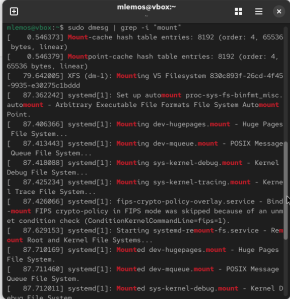

## Добавление оптического привода Rocky

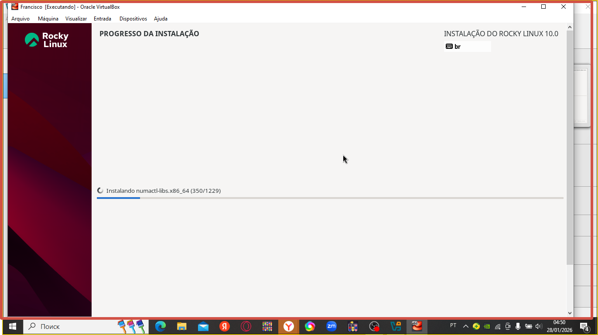

## Запуск виртуальной машины

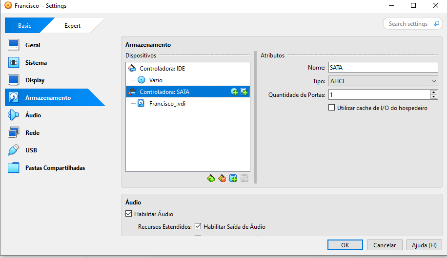

## Установка Rocky Linux 9.0

## Настройки установки операционной системы

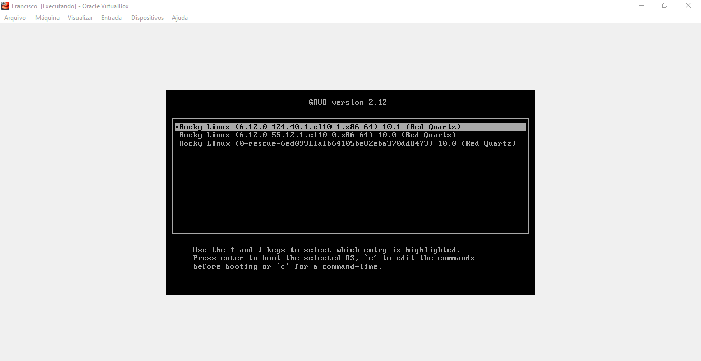

## Место установки и выбор программ

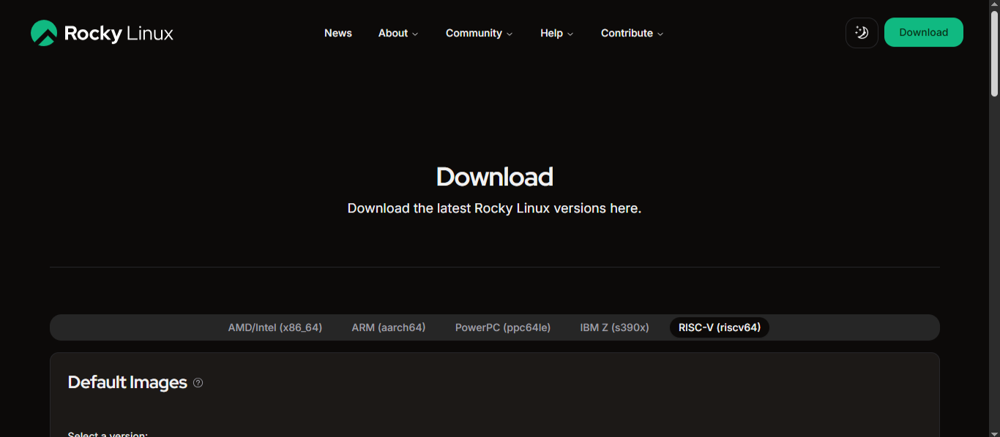

## Отключение KDUMP и настройка сети

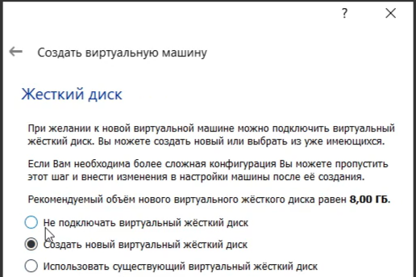

## Установка пароля для root

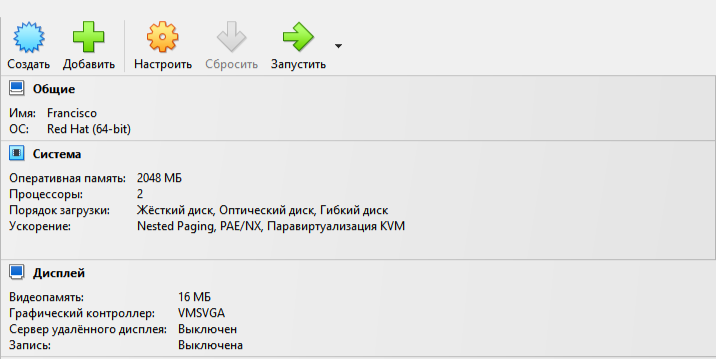

## Процесс установки системы

## Завершение установки и первый запуск

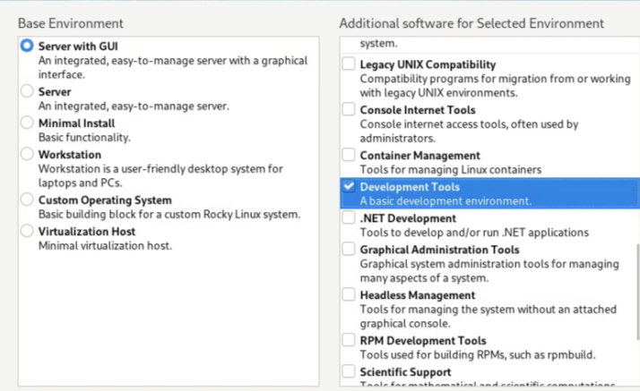

## Вывод

В ходе выполнения лабораторной работы были приобретены практические навыки установки операционной системы на виртуальную машину и настройки минимально необходимых для дальнейшей работы сервисов.

## Список литературы

[1] Документация Rocky Linux: https://docs.rockylinux.org
[2] Руководство по установке VirtualBox

