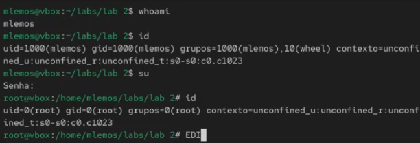
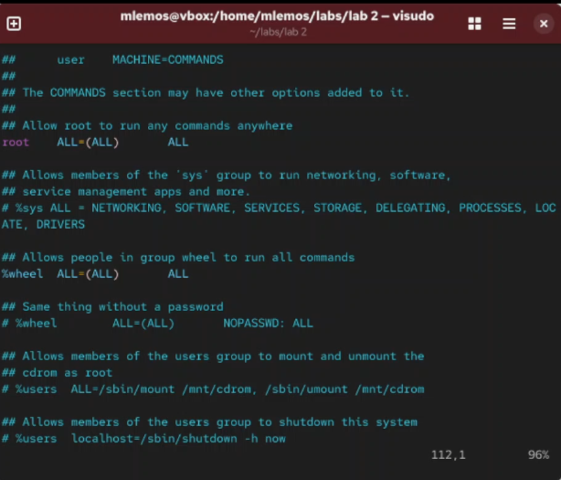
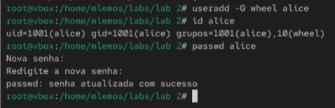
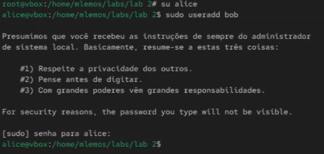
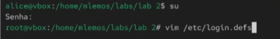
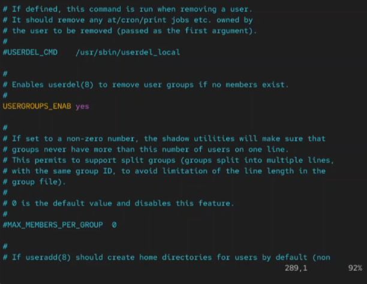
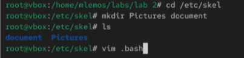

# Цель работы

- Изучить основы управления процессами в ОС Linux.
- Освоить команды для мониторинга и контроля процессов.
- Научиться управлять приоритетами и сигналами процессов.
- Изучить механизмы фонового и интерактивного выполнения задач.

# Теоретическое введение

**Управление процессами** — одна из ключевых задач администратора Linux. Процесс представляет собой выполняющуюся программу с выделенными ресурсами. Каждый процесс имеет уникальный идентификатор (PID), приоритет (nice value) и состояние.

Основные команды для работы с процессами:
- `ps` — просмотр информации о процессах
- `top` / `htop` — интерактивный мониторинг
- `kill` — отправка сигналов процессам
- `nice` / `renice` — управление приоритетами
- `jobs`, `fg`, `bg` — управление фоновыми задачами
- `dd`, `sleep` — создание тестовых нагрузок

# Выполнение лабораторной работы

## Часть 1: Просмотр и мониторинг процессов

1. Просмотр всех запущенных процессов с помощью `ps aux`

   { width=100% }

2. Использование `ps -ef` для просмотра процессов в другом формате

   { width=100% }

3. Интерактивный мониторинг процессов с `top`

   { width=100% }

4. Просмотр дерева процессов с `pstree`

   { width=100% }

5. Поиск конкретного процесса по имени с `pgrep`

   { width=100% }

6. Просмотр открытых файлов процесса с `lsof`

   { width=100% }

## Часть 2: Создание и управление процессами

7. Создание процесса в фоне с помощью `&`

   { width=100% }

8. Использование команды `dd` для создания нагрузки:

