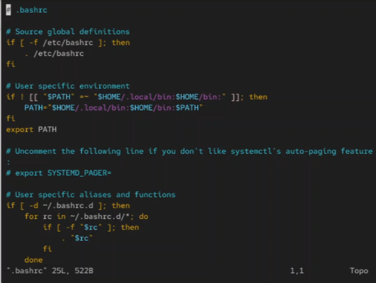
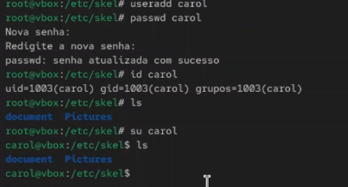
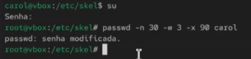
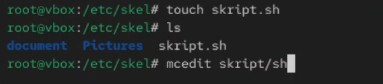
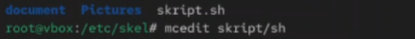
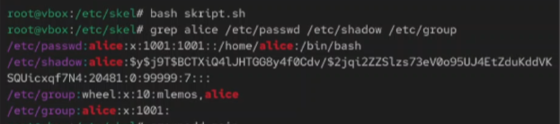
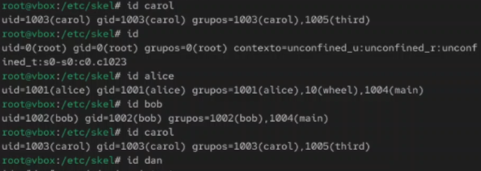

## Докладчик

* Лемуш Мариу Франсишку
* Студент группы НПИбд-01-24
* Студ. билет 1032239162
* Российский университет дружбы народов

## Цель работы

- Изучить механизмы управления пользователями и группами в ОС Linux
- Получить практические навыки создания учетных записей
- Рассмотреть работу с правами доступа

## Теоретическая справка

**Управление пользователями и группами в Linux**

Основные конфигурационные файлы:
- `/etc/passwd` — информация о пользователях
- `/etc/shadow` — зашифрованные пароли
- `/etc/group` — информация о группах
- `/etc/skel/` — шаблон домашней директории

Основные команды: `useradd`, `usermod`, `groupadd`, `passwd`, `id`, `whoami`, `su`.

## Команды whoami, id, su

## Поиск строки в файле

## Создание пользователя alice

## Переключение на пользователя alice

## Переключение на root

## Изменение параметра USERGROUPS_ENAB

## Создание каталогов в /etc/skel

## Редактирование .bashrc

## Создание пользователя carol

## Изменение параметров пароля

## Создание файла скрипта

## Добавление содержимого скрипта

## Запуск скрипта

## Создание групп

<!-- Imagem 15 não existe, foi removida -->

## Вывод

В ходе выполнения лабораторной работы были изучены основы управления пользователями и группами в ОС Linux. Освоены команды `useradd`, `usermod`, `groupadd`, `passwd`, `id`, `whoami`, `su`, а также работа с конфигурационными файлами `/etc/passwd`, `/etc/shadow`, `/etc/group` и шаблонной директорией `/etc/skel/`.

## Список литературы

[1] Linux man pages: useradd(8), usermod(8), groupadd(8), passwd(1)
