## Докладчик

* Лемуш Мариу Франсишку
* Студент группы НПИбд-01-24
* Студ. билет 1032239162
* Российский университет дружбы народов

## Цель работы

- Получить навыки настройки базовых и специальных прав доступа для групп пользователей в операционной системе типа Linux
- Изучить механизмы работы с правами доступа и ACL

## Теоретическая справка

**Права доступа в Linux**

Основные понятия:
- `chmod` — изменение прав доступа
- `chgrp` — изменение группы-владельца
- `ACL` — списки контроля доступа
- Sticky-bit — специальный бит для общих каталогов

## Работа в учётной записи root

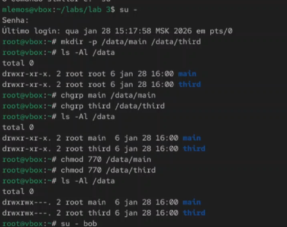

## Работа в учётной записи пользователя bob

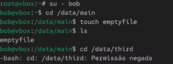

## Работа в учётной записи пользователя alice

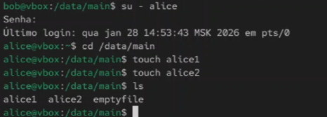

## Проверка файлов под пользователем bob

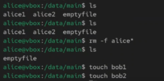

## Установка специальных битов

## Работа под пользователем alice

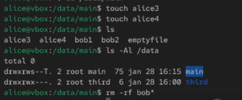

## Установка прав r-x

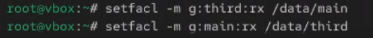

## Создание нового файла

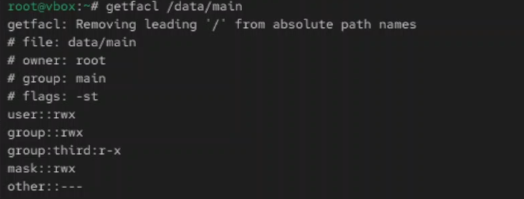

## Установка ACL по умолчанию

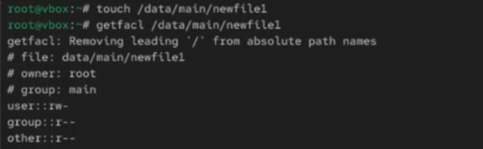

## Проверка ACL в каталоге third

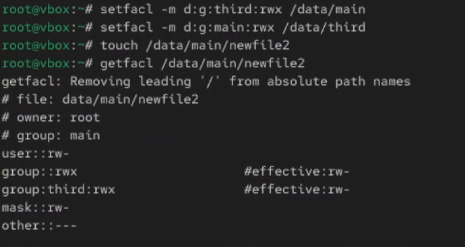

## Работа с пользователем carol

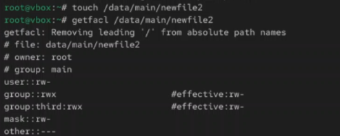

## Создание дополнительных файлов

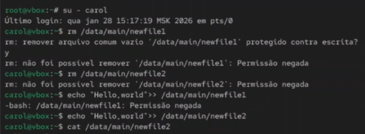

## Проверка ACL

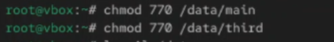

## Изменение прав доступа

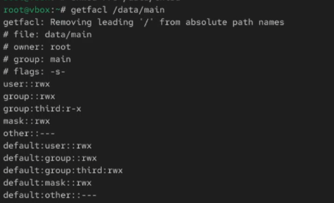

## Проверка Sticky-бита

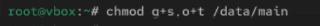

## Результаты настройки прав

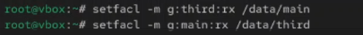

## Вывод

В ходе выполнения лабораторной работы были получены навыки настройки базовых и специальных прав доступа для групп пользователей в операционной системе типа Linux. Освоены команды `chmod`, `chgrp`, работа с ACL и Sticky-битом.

## Список литературы

[1] Linux man pages: chmod(1), chgrp(1), setfacl(1), getfacl(1)
