# Цель работы

- Развить навыки администрирования ОС Linux. 
- Получить практическое знакомство с технологией SELinux. 
- Изучить основы управления пользователями и группами.
- Освоить настройку прав доступа и дисковых квот.
- Научиться работать с системными сервисами и журналами.

# Теоретическое введение

1. **SELinux (Security-Enhanced Linux)** обеспечивает усиление защиты путем внесения изменений как на уровне ядра, 
так и на уровне пространства пользователя, что превращает ее в действительно непробиваемую операционную систему.

2. **Управление пользователями и группами** — основа администрирования Linux, включающая создание, модификацию и удаление учетных записей.

3. **Права доступа (chmod, chown, ACL)** определяют, кто и как может взаимодействовать с файлами и директориями.

4. **Системные сервисы (systemd)** управляют запуском и остановкой служб в современном Linux.

5. **Мониторинг и журналирование** позволяют отслеживать состояние системы и диагностировать проблемы.

# Выполнение лабораторной работы

## Часть 1: SELinux и безопасность

1. Проверка режима работы SELinux с помощью команд getenforce и sestatus

   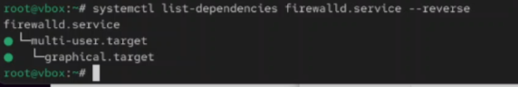{ width=100% }

2. Просмотр текущей политики SELinux

   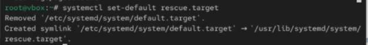{ width=100% }

3. Изменение контекста безопасности файла

   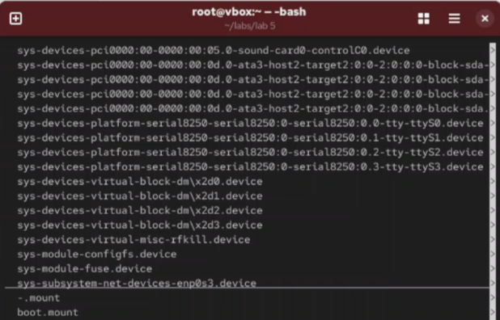{ width=100% }

4. Анализ логов SELinux в /var/log/audit/audit.log

   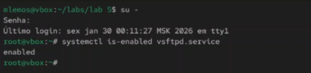{ width=100% }

## Часть 2: Управление пользователями и группами

5. Создание нового пользователя с помощью useradd

   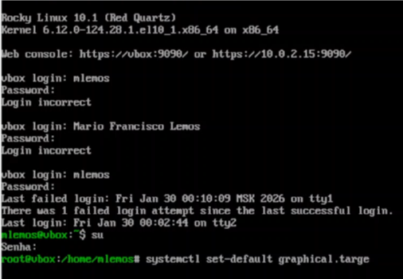{ width=100% }

6. Установка и смена пароля пользователя (passwd)

   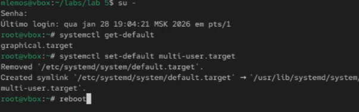{ width=100% }

7. Создание новой группы (groupadd)

   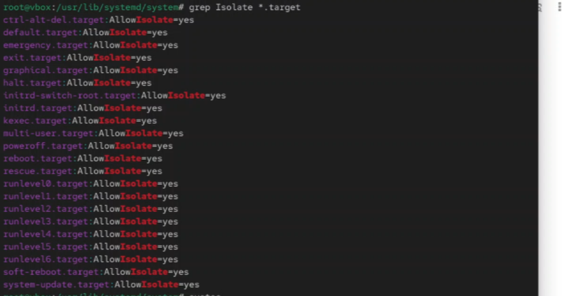{ width=100% }

8. Добавление пользователя в дополнительную группу (usermod -aG)

   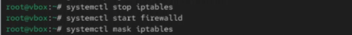{ width=100% }

9. Просмотр информации о пользователях (/etc/passwd)

   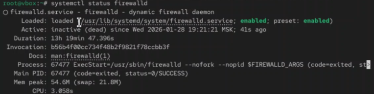{ width=100% }

10. Просмотр информации о группах (/etc/group)

    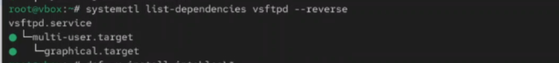{ width=100% }

11. Удаление пользователя (userdel)

    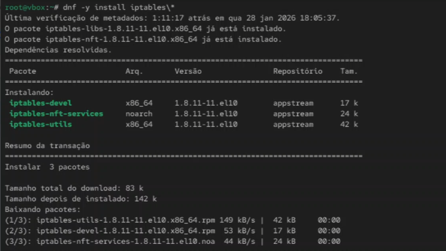{ width=100% }

12. Удаление группы (groupdel)

    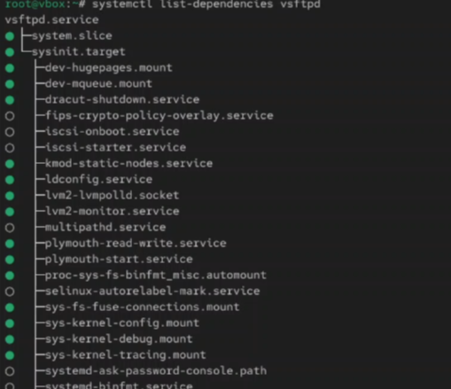{ width=100% }

## Часть 3: Права доступа к файлам и каталогам

13. Просмотр текущих прав доступа (ls -l)

    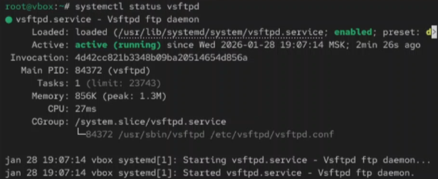{ width=100% }

14. Изменение прав доступа с помощью chmod (числовой метод)

    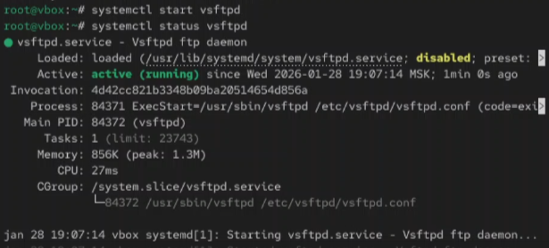{ width=100% }

15. Изменение прав доступа с помощью chmod (символьный метод)

    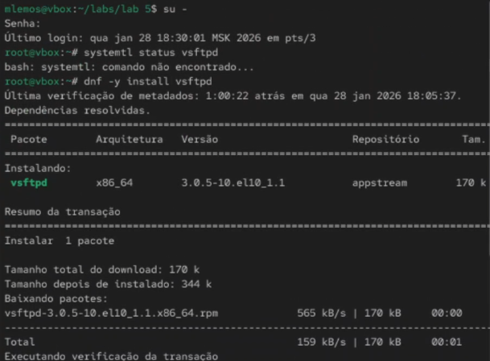{ width=100% }

16. Изменение владельца файла (chown)

    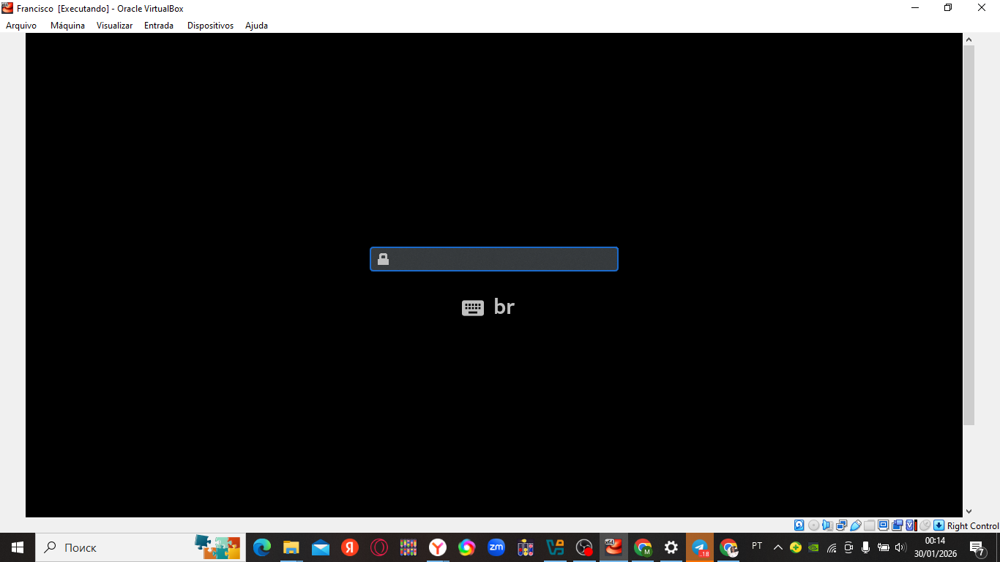{ width=100% }
# Вывод

В ходе выполнения лабораторной работы были развиты навыки администрирования ОС Linux, получено практическое 
знакомство с технологией SELinux, управлением пользователями и группами, настройкой прав доступа, работой с процессами, 
управлением системными сервисами и мониторингом системы. Полученные знания являются основой для эффективного 
администрирования Linux-систем.
