## Докладчик

* Лемуш Мариу Франсишку
* Студент группы НПИбд-01-24
* Студ. билет 1032239162
* Российский университет дружбы народов
## Цель работы

- Получить навыки управления процессами операционной системы
- Изучить механизмы управления заданиями и приоритетами
- Научиться работать с сигналами процессов

## Теоретическая справка

**Управление процессами в Linux**

Основные понятия:
- `jobs`, `fg`, `bg` — управление заданиями
- `kill` — отправка сигналов процессам
- `nice`, `renice` — управление приоритетами
- `top`, `ps` — мониторинг процессов

## Получение полномочий администратора

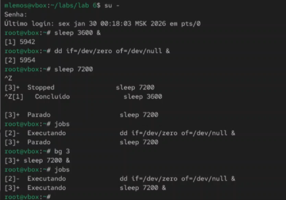

## Перемещение и отмена заданий

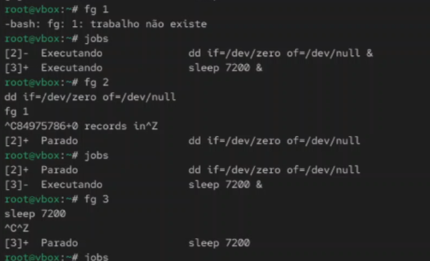

## Работа с терминалом

## Управление процессом dd

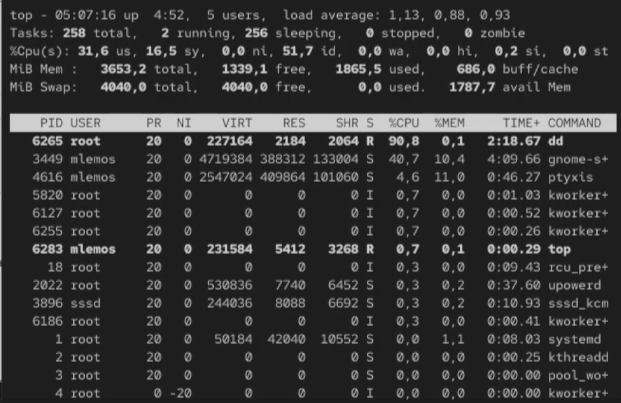

## Получение полномочий администратора

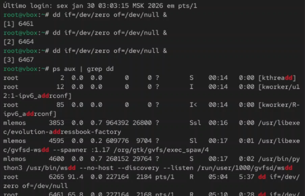

## Просмотр и изменение приоритета

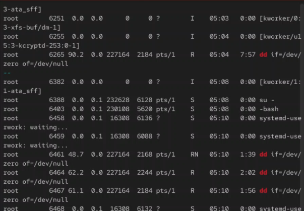

## Иерархия процессов

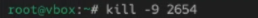

## Закрытие корневой оболочки

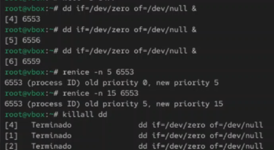

## Самостоятельная работа - задание 1

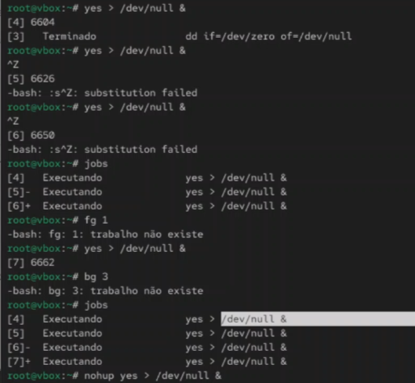

## Запуск программы yes

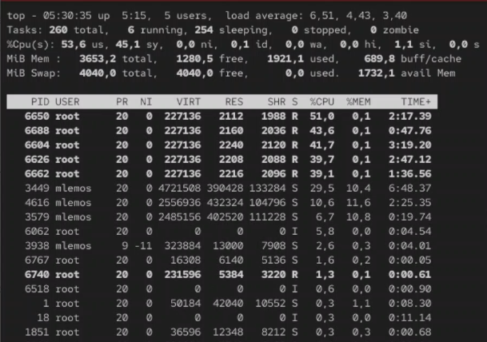

## Управление фоновыми процессами
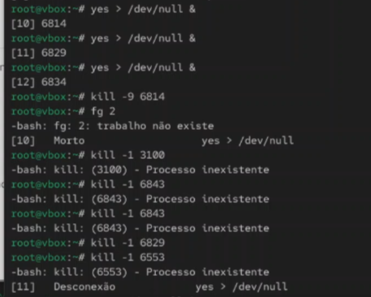

## Информация о процессах

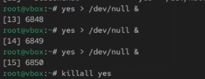

## Отправка сигналов процессам

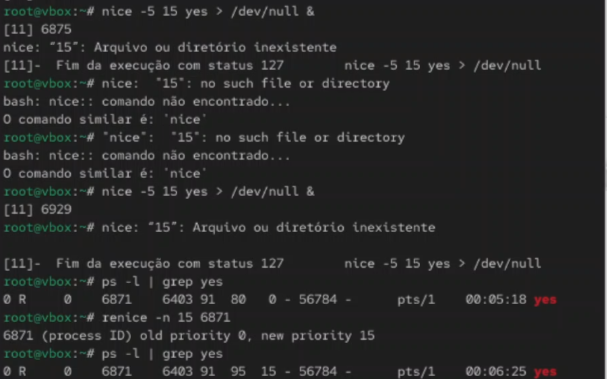

## Одновременное завершение процессов

## Изменение приоритетов после запуска

## Мониторинг процессов с top

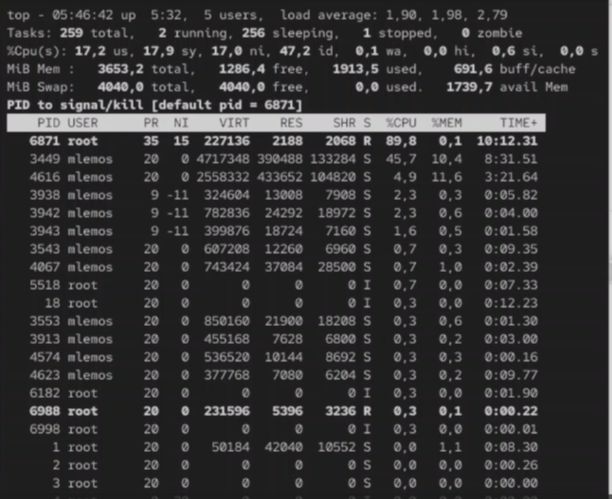

## Просмотр процессов с ps

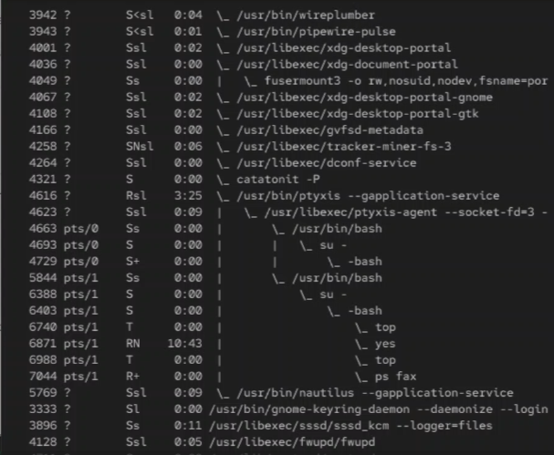

## Отправка сигнала SIGTERM

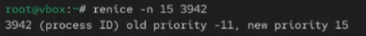

## Отправка сигнала SIGKILL

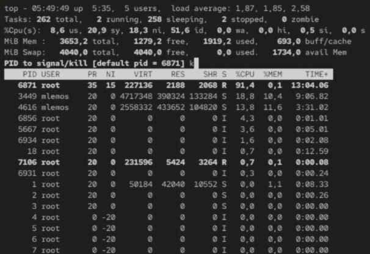

## Итоговая проверка

## Вывод

В ходе выполнения лабораторной работы были получены навыки управления процессами операционной системы. Освоены команды управления заданиями (`jobs`, `fg`, `bg`), отправки сигналов (`kill`), изменения приоритетов (`nice`, `renice`) и мониторинга процессов (`top`, `ps`).

## Список литературы

[1] Linux man pages: ps(1), top(1), kill(1), nice(1), renice(1)
