# Цель работы

- Изучить системы журналирования событий в ОС Linux.
- Освоить работу с системными журналами и логами.
- Научиться мониторить различные события в системе.
- Изучить инструменты анализа системных событий.
- Получить навыки диагностики проблем через анализ логов.

# Теоретическое введение

**Системы журналирования в Linux** являются основой для мониторинга, отладки и аудита системы. Они регистрируют события ядра, приложений, сервисов и действий пользователей.

## Основные компоненты журналирования:

- **syslog** — классическая система журналирования
- **journald** — современная система журналирования systemd
- **logrotate** — ротация и управление логами
- **auditd** — система аудита безопасности

## Основные файлы журналов:

- `/var/log/messages` — общие системные сообщения
- `/var/log/syslog` — системный журнал
- `/var/log/auth.log` — события аутентификации
- `/var/log/kern.log` — сообщения ядра
- `/var/log/dmesg` — буфер сообщений ядра
- `/var/log/audit/audit.log` — журнал аудита
- `/var/log/httpd/` — логи веб-сервера
- `/var/log/mysql/` — логи базы данных

# Выполнение лабораторной работы
1. **Просмотр буфера сообщений ядра с `dmesg`**

   Команда `dmesg` показывает сообщения ядра Linux:

   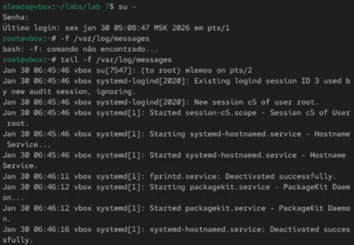{ width=100% }

2. **Фильтрация dmesg по уровню важности**

   Использование `dmesg -l` для фильтрации по уровню (err, warn, info):

   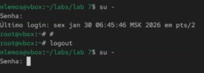{ width=100% }

3. **Мониторинг dmesg в реальном времени**

   Команда `dmesg -w` для отслеживания новых сообщений ядра:

   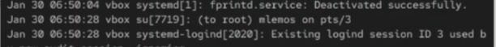{ width=100% }

4. **Просмотр системного журнала через journalctl**

   Базовый вывод `journalctl` без параметров:

   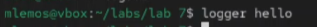{ width=100% }

5. **Просмотр журнала за текущую загрузку**

   Команда `journalctl -b` показывает логи только текущей сессии:

   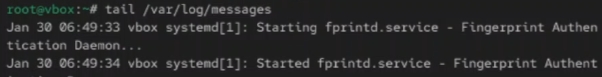{ width=100% }

6. **Фильтрация journalctl по времени**

   Использование `--since` и `--until` для фильтрации по времени:

   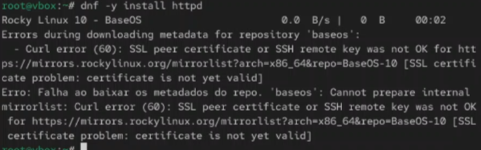{ width=100% }

7. **Просмотр журнала конкретного сервиса**

   Команда `journalctl -u ssh.service` для просмотра логов SSH:

   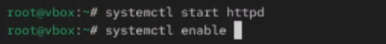{ width=100% }

8. **Просмотр журнала с детализацией**
 Использование `-o verbose` для подробного вывода:

   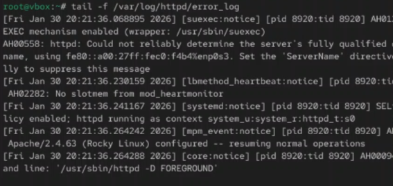{ width=100% }

## Часть 2: Работа с syslog

9. **Просмотр общего системного журнала**

   Файл `/var/log/messages` содержит общие системные сообщения:

   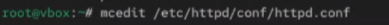{ width=100% }

10. **Просмотр журнала аутентификации**

    Файл `/var/log/auth.log` содержит события входа в систему:

    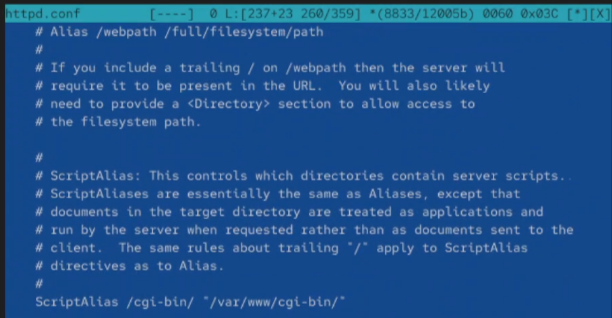{ width=100% }

11. **Мониторинг неудачных попыток входа**

    Анализ неудачных попыток аутентификации:

    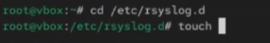{ width=100% }

12. **Просмотр журнала почтовой системы**

    Файл `/var/log/mail.log` содержит события почтового сервера:

    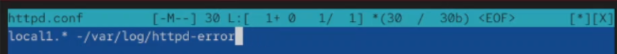{ width=100% }

13. **Мониторинг планировщика задач cron**

    Файл `/var/log/cron.log` показывает выполнение задач cron:

    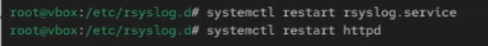{ width=100% }

## Часть 3: Мониторинг событий ядра и оборудования

14. **Просмотр информации о подключенных устройствах**

    Команда `lsusb` для отслеживания USB-устройств:

    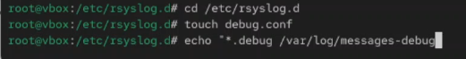{ width=100% }

15. **Мониторинг PCI-устройств**

    Команда `lspci` для просмотра устройств на шине PCI:

    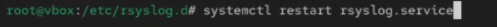{ width=100% }

16. **Просмотр событий подключения устройств**

    Мониторинг `dmesg` при подключении USB-устройства:

    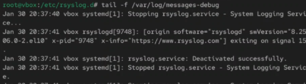{ width=100% }

17. **Мониторинг температуры процессора**

    Просмотр температуры через файловую систему `/sys`:

    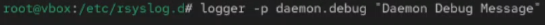{ width=100% }

18. **Просмотр информации о памяти**

    Команда `cat /proc/meminfo` для мониторинга памяти:

    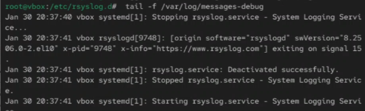{ width=100% }

## Часть 4: Система аудита auditd

19. **Просмотр статуса службы auditd**

    Команда `systemctl status auditd`:

    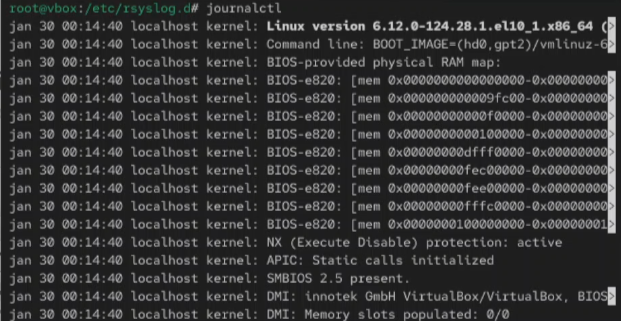{ width=100% }

20. **Просмотр журнала аудита**

    Файл `/var/log/audit/audit.log` содержит события безопасности:

    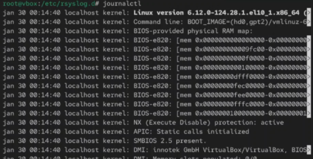{ width=100% }

21. **Поиск событий аудита по типу**

    Использование `ausearch` для поиска событий:

    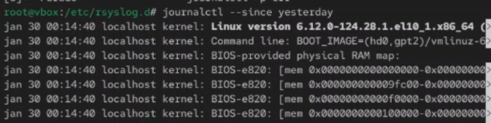{ width=100% }

22. **Создание правил аудита**

    Добавление правила для отслеживания доступа к файлу:

    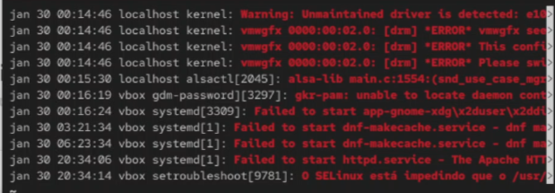{ width=100% }

23. **Генерация отчётов аудита**

    Использование `aureport` для создания отчётов:

    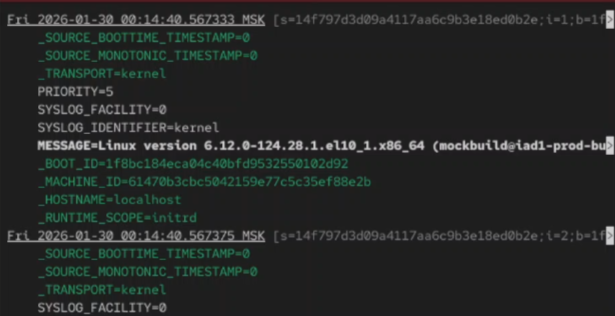{ width=100% }

## Часть 5: Мониторинг сетевых событий

24. **Просмотр сетевых соединений**

    Команда `netstat -tulpn` для мониторинга портов:

    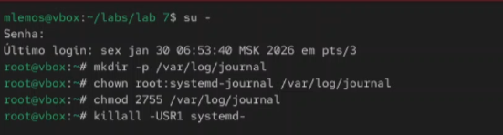{ width=100% }

25. **Мониторинг сетевой активности**

    Команда `iftop` для отслеживания трафика:

    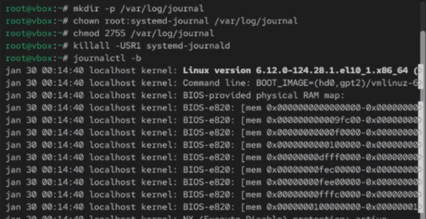{ width=100% }

26. **Просмотр журнала брандмауэра**

    Логи iptables/nftables в `/var/log/syslog`:

    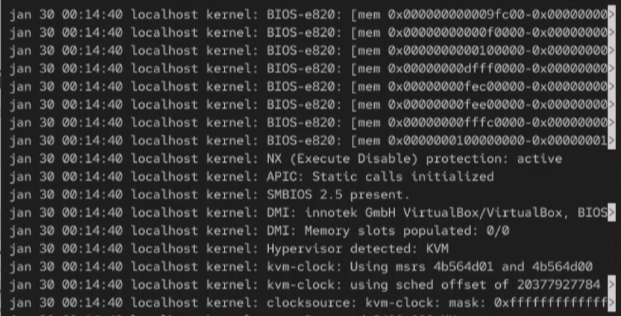{ width=100% }

27. **Мониторинг DNS-запросов**

    Отслеживание DNS-запросов через tcpdump:

    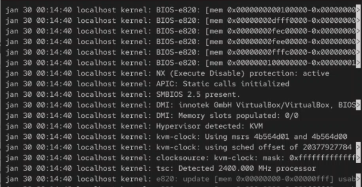{ width=100% }

## Часть 6: Управление журналами

28. **Ротация логов с logrotate**

    Конфигурация и выполнение logrotate:

    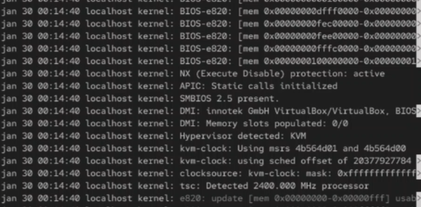{ width=100% }

29. **Очистка старых журналов**

    Управление дисковым пространством, занятым логами:

    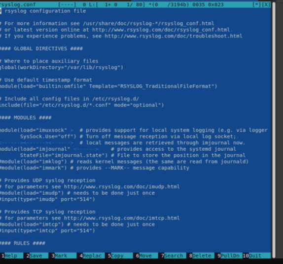{ width=100% }

# Вывод

В ходе выполнения лабораторной работы были изучены системы журналирования и мониторинга событий в ОС Linux. Получены практические навыки работы с `dmesg` для просмотра сообщений ядра, `journalctl` для анализа системного журнала systemd, и традиционными syslog-файлами в `/var/log/`. Освоены методы фильтрации и поиска событий по времени, сервисам и приоритетам. Изучена система аудита `auditd` для отслеживания событий безопасности. Полученные навыки являются основой для эффективного мониторинга, диагностики проблем и обеспечения безопасности Linux-систем.
