## Докладчик

* Лемуш Мариу Франсишку
* Студент группы НПИбд-01-24
* Студ. билет 1032239162
* Российский университет дружбы народов
## Цель работы

- Получить навыки работы с планировщиками событий cron и at
- Изучить механизмы периодического и однократного выполнения задач
- Научиться настраивать задания по расписанию

## Теоретическая справка

**Планировщики событий в Linux**

Основные понятия:
- `cron` — планировщик для периодических задач
- `at` — планировщик для однократных задач
- `crontab` — файл с расписанием задач
- `/etc/cron.hourly/`, `/etc/cron.daily/` — директории для скриптов

## Просмотр статуса демона crond

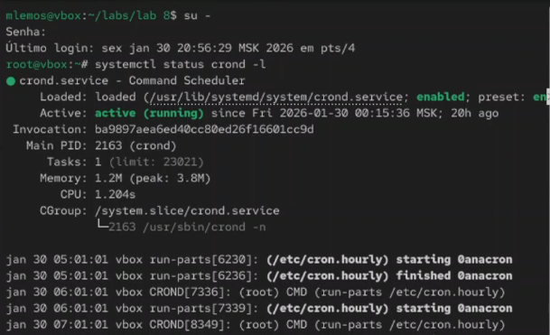

## Просмотр содержимого файла /etc/crontab

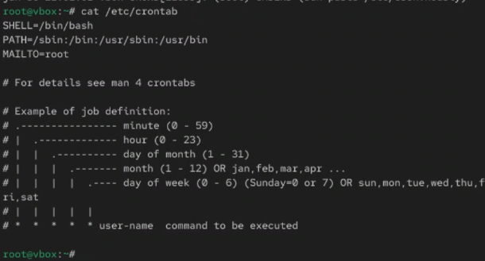

## Список заданий в расписании

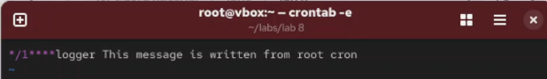

## Добавление строки в расписание

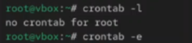

## Просмотр списка заданий и журнала событий

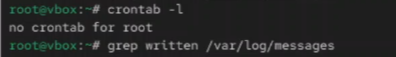

## Изменение записи в расписании

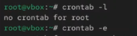

## Просмотр обновленного списка заданий

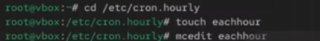

## Создание файла сценария в /etc/cron.hourly

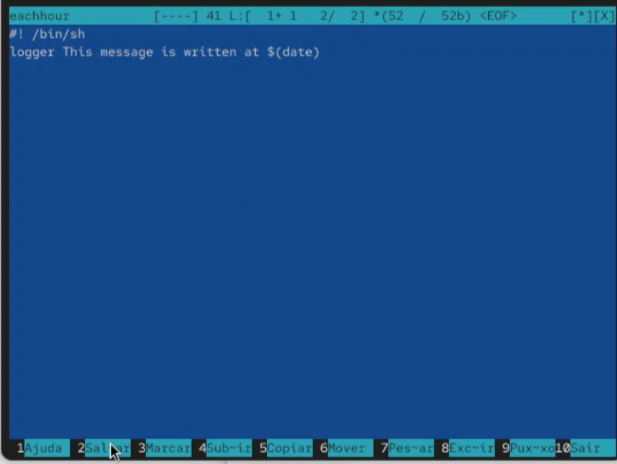

## Запись скрипта в файл eachhour

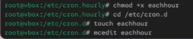

## Создание файла с расписанием

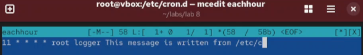

## Добавление содержимого в файл расписания

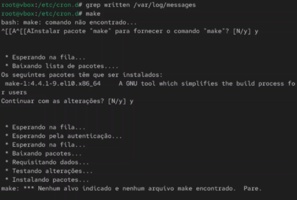

## Просмотр журнала через 2 часа

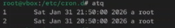

## Проверка службы atd

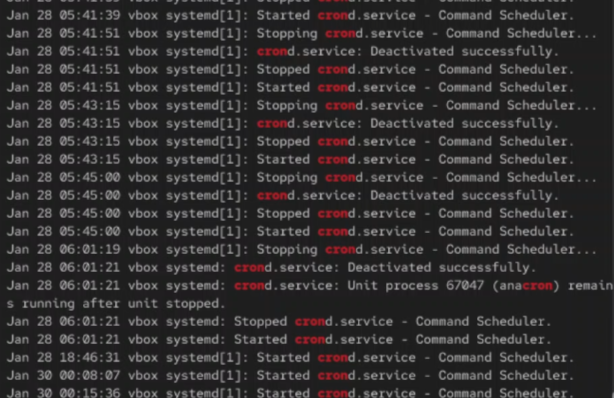

## Создание задачи с at

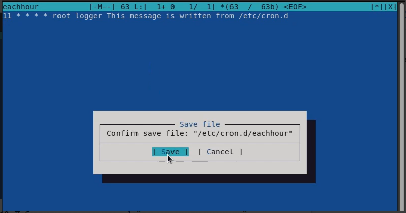

## Вывод

В ходе выполнения лабораторной работы были получены навыки работы с планировщиками событий cron и at. Освоены методы создания периодических задач с помощью crontab и однократных задач с помощью at, настройка расписаний и мониторинг выполнения заданий.

## Список литературы

[1] Linux man pages: cron(8), crontab(5), at(1), atd(8)
