# Цель работы

- Изучить систему принудительного контроля доступа SELinux.
- Освоить основные команды для работы с SELinux.
- Научиться управлять политиками и контекстами безопасности.
- Понять различия между режимами работы SELinux.
- Получить навыки анализа и модификации политик SELinux.

# Теоретическое введение

**SELinux (Security-Enhanced Linux)** — это реализация системы принудительного контроля доступа (MAC), встроенная в ядро Linux. Она обеспечивает дополнительный уровень безопасности помимо стандартных прав доступа (DAC).

## Основные понятия SELinux:

- **Режимы работы**:
  - `Enforcing` — политики применяются, нарушения блокируются и логируются
  - `Permissive` — нарушения только логируются, но не блокируются
  - `Disabled` — SELinux отключен

- **Политики**:
  - `targeted` — защита только выбранных процессов
  - `mls` — многоуровневая защита (Multi-Level Security)

- **Контекст безопасности**:
  - `user:role:type:level` — например, `system_u:object_r:httpd_sys_content_t:s0`

- **Типы файлов SELinux**:
  - `httpd_sys_content_t` — для файлов веб-сервера
  - `etc_t` — для конфигурационных файлов
  - `bin_t` — для исполняемых файлов

## Основные команды SELinux:

- `getenforce` / `setenforce` — просмотр/изменение режима
- `sestatus` — статус SELinux
- `ls -Z` — просмотр контекста файлов
- `ps -Z` — просмотр контекста процессов
- `chcon` — изменение контекста
- `restorecon` — восстановление контекста
- `semanage` — управление политиками
- `audit2why` / `audit2allow` — анализ логов и создание политик

# Выполнение лабораторной работы
## Часть 1: Основы SELinux

1. **Проверка режима работы SELinux**

   Команда `getenforce` показывает текущий режим SELinux:

   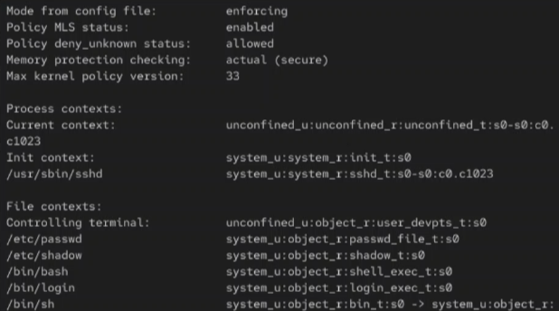{ width=100% }

2. **Детальная информация о статусе SELinux**

   Команда `sestatus` выводит подробную информацию о состоянии SELinux:

   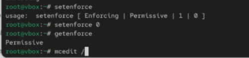{ width=100% }

3. **Изменение режима SELinux**

   Команда `setenforce` для переключения между Enforcing и Permissive:

   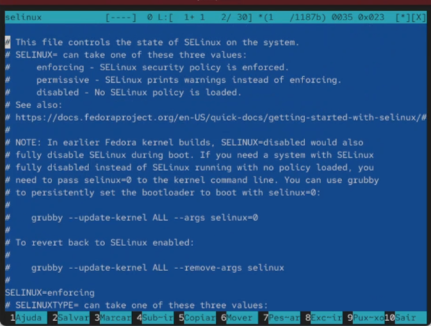{ width=100% }

4. **Конфигурационный файл SELinux**

   Файл `/etc/selinux/config` содержит постоянные настройки SELinux:

   { width=100% }

## Часть 2: Контексты безопасности

5. **Просмотр контекста файлов**

   Команда `ls -Z` показывает контекст SELinux для файлов:

   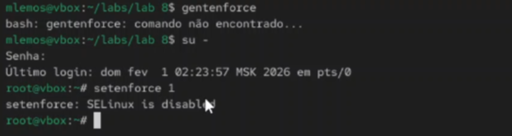{ width=100% }

6. **Просмотр контекста процессов**

   Команда `ps -Z` отображает контекст запущенных процессов:

   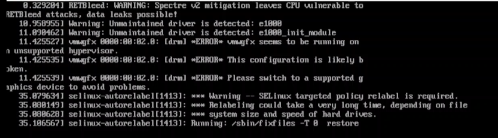{ width=100% }

7. **Просмотр контекста домашней директории**

   Контекст файлов в домашней директории пользователя:

   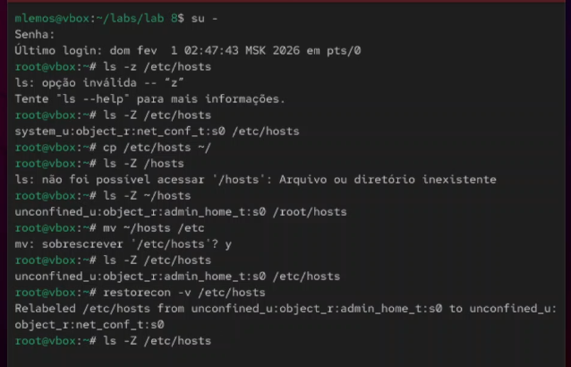{ width=100% }

8. **Просмотр контекста системных директорий**

   Контекст файлов в `/etc` и других системных директориях:

   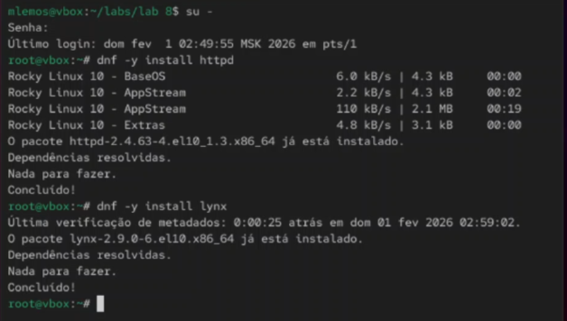{ width=100% }

## Часть 3: Изменение контекста
9. **Изменение контекста файла с chcon**

   Команда `chcon` для временного изменения контекста:

   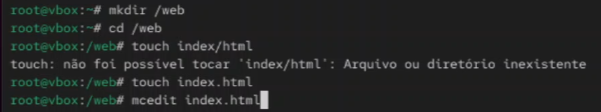{ width=100% }

10. **Восстановление контекста с restorecon**

    Команда `restorecon` возвращает контекст по умолчанию:

    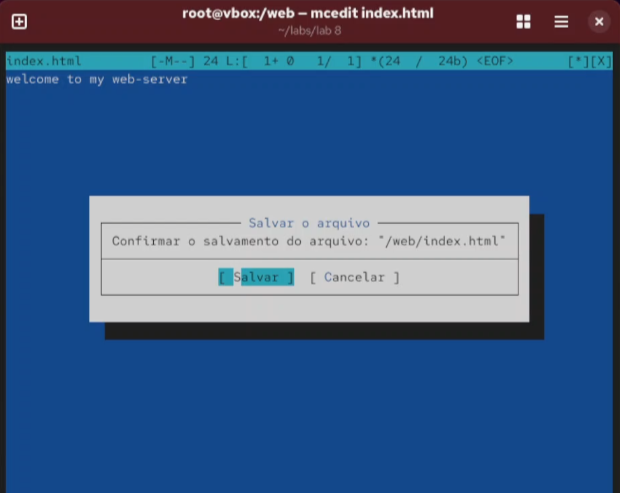{ width=100% }

11. **Рекурсивное изменение контекста**

    Изменение контекста для всех файлов в директории:

    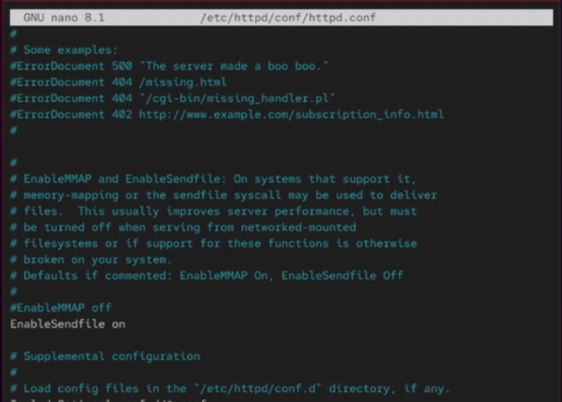{ width=100% }

12. **Копирование файлов и контекст**

    Как ведет себя контекст при копировании файлов:

    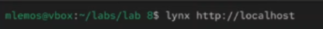{ width=100% }

## Часть 4: Управление политиками

13. **Просмотр booleans SELinux**

    Команда `getsebool` для просмотра логических переключателей:

    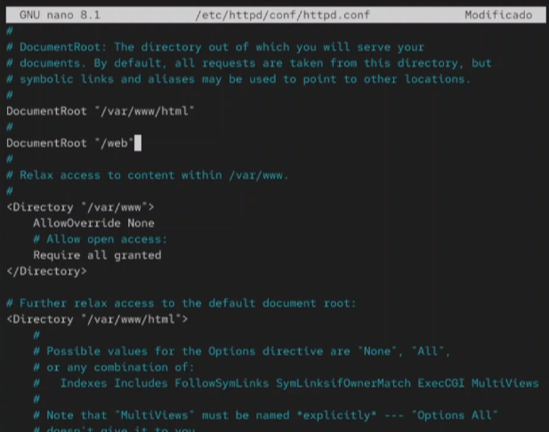{ width=100% }

14. **Изменение booleans SELinux**

    Команда `setsebool` для включения/отключения опций:

    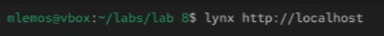{ width=100% }

15. **Управление портами с semanage**

    Команда `semanage port` для управления сетевыми портами:

    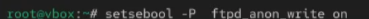{ width=100% }

16. **Управление контекстами файлов**

    Команда `semanage fcontext` для управления контекстами:

    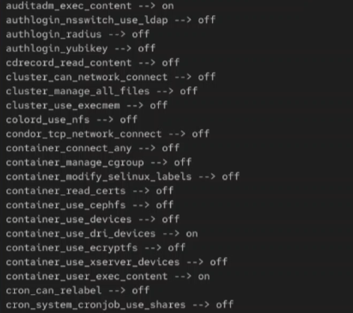{ width=100% }

## Часть 5: Анализ и аудит

17. **Просмотр логов SELinux**

    Журнал SELinux в `/var/log/audit/audit.log`:

    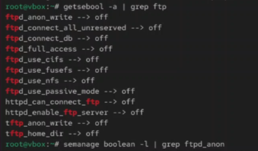{ width=100% }

18. **Анализ запрещенных операций**

    Команда `audit2why` для анализа причин блокировок:

    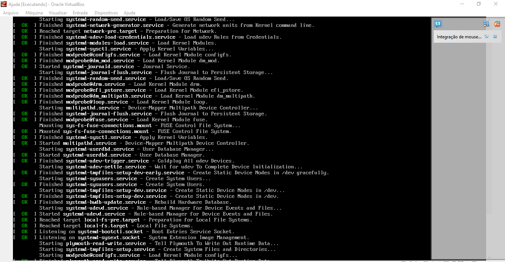{ width=100% }

# Сравнение режимов SELinux

| Режим | Поведение | Использование |
|-------|-----------|---------------|
| **Enforcing** | Политики применяются, нарушения блокируются и логируются | Продуктивные серверы |
| **Permissive** | Нарушения логируются, но не блокируются | Отладка, тестирование |
| **Disabled** | SELinux полностью отключен | Не рекомендуется |

# Основные типы контекстов

| Тип | Назначение |
|-----|------------|
| `httpd_sys_content_t` | Файлы веб-сервера |
| `etc_t` | Конфигурационные файлы |
| `bin_t` | Исполняемые файлы |
| `var_log_t` | Файлы журналов |
| `home_user_t` | Файлы пользователей |
| `tmp_t` | Временные файлы |

# Вывод

В ходе выполнения лабораторной работы была изучена система принудительного контроля доступа SELinux. Получены практические навыки работы с основными командами: `getenforce`, `setenforce`, `sestatus` для управления режимами; `ls -Z`, `ps -Z` для просмотра контекстов безопасности; `chcon` и `restorecon` для изменения и восстановления контекстов; `getsebool` и `setsebool` для управления логическими переключателями; `semanage` для управления портами и контекстами файлов. Освоены методы анализа логов SELinux с помощью `audit2why` для диагностики проблем безопасности. Полученные знания позволяют эффективно настраивать и обслуживать системы с SELinux, обеспечивая дополнительный уровень безопасности.
