# Цель работы

- Изучить архитектуру модулей ядра Linux.
- Освоить основные команды для управления модулями.
- Научиться загружать и выгружать модули ядра.
- Получить навыки получения информации о загруженных модулях.
- Понять зависимости между модулями и их параметры.

# Теоретическое введение

**Модули ядра Linux** — это фрагменты кода, которые могут быть загружены и выгружены в работающее ядро по требованию. Они расширяют функциональность ядра без необходимости перезагрузки системы.

## Основные понятия:

- **Модуль** — динамически загружаемый компонент ядра
- **Зависимости** — модули могут требовать другие модули
- **Параметры** — модули могут принимать параметры при загрузке
- **Подпись модуля** — криптографическая подпись для безопасности

## Основные команды для работы с модулями:

- `lsmod` — список загруженных модулей
- `modinfo` — информация о модуле
- `insmod` — загрузка модуля
- `rmmod` — выгрузка модуля
- `modprobe` — умная загрузка/выгрузка с зависимостями
- `depmod` — создание файла зависимостей
- `dmesg` — просмотр сообщений ядра (включая сообщения модулей)

## Директории с модулями:

- `/lib/modules/$(uname -r)/` — директория с модулями для текущего ядра
- `/etc/modprobe.d/` — конфигурационные файлы для modprobe
- `/etc/modules` — список модулей для загрузки при старте

# Выполнение лабораторной работы
## Часть 1: Просмотр информации о модулях

1. **Просмотр всех загруженных модулей**

   Команда `lsmod` показывает все модули, загруженные в ядро:

   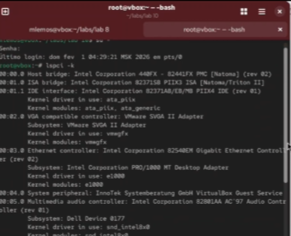{ width=100% }

2. **Детальная информация о конкретном модуле**

   Команда `modinfo` показывает подробную информацию о модуле:

   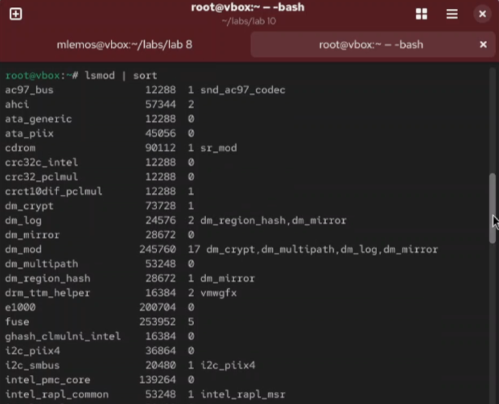{ width=100% }

3. **Просмотр модулей для конкретного устройства**

   Поиск модулей, связанных с сетевыми устройствами:

   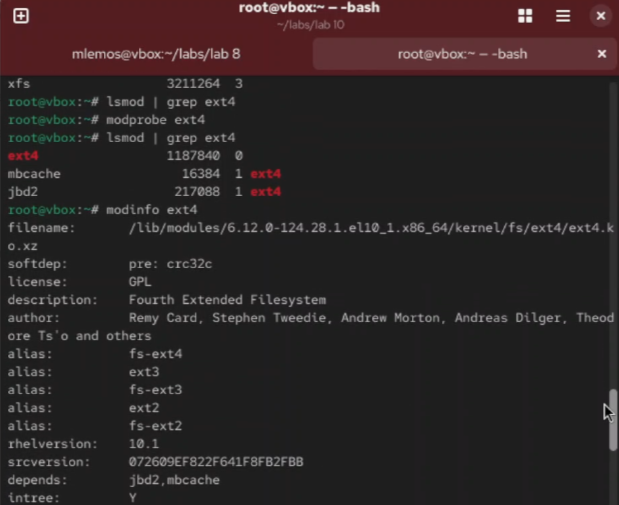{ width=100% }

4. **Просмотр параметров модуля**

   Информация о параметрах, которые можно передать модулю:

   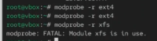{ width=100% }

5. **Просмотр зависимостей модуля**

   Какие модули требуются для работы данного модуля:

   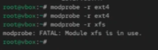{ width=100% }

6. **Просмотр всех доступных модулей**

   Список всех модулей в системе для текущего ядра:

   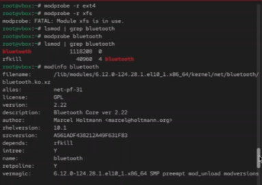{ width=100% }

## Часть 2: Загрузка и выгрузка модулей

7. **Загрузка модуля с insmod**

   Команда `insmod` для прямой загрузки модуля:

   { width=100% }

8. **Загрузка модуля с modprobe**

   Команда `modprobe` для загрузки модуля с разрешением зависимостей:

   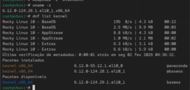{ width=100% }

9. **Загрузка модуля с параметрами**

   Передача параметров при загрузке модуля:

   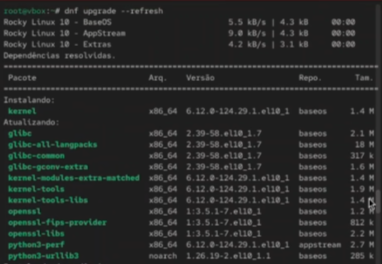{ width=100% }

10. **Выгрузка модуля с rmmod**

    Команда `rmmod` для выгрузки модуля:

    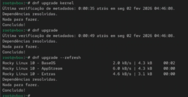{ width=100% }

11. **Выгрузка модуля с modprobe -r**

    Команда `modprobe -r` для выгрузки модуля и его зависимостей:

    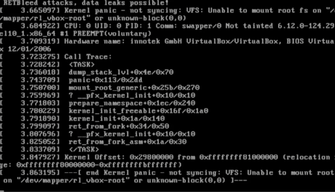{ width=100% }

12. **Попытка выгрузки используемого модуля**

    Ошибка при попытке выгрузить модуль, который используется:

    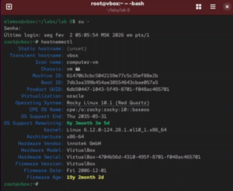{ width=100% }

## Часть 3: Управление зависимостями

13. **Обновление зависимостей модулей**

    Команда `depmod` для обновления файла зависимостей:

    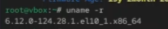{ width=100% }

14. **Просмотр файла зависимостей**

    Содержимое файла `/lib/modules/$(uname -r)/modules.dep`:

    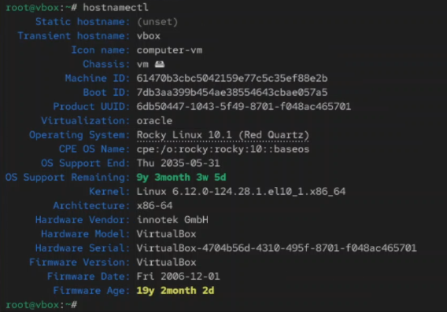{ width=100% }
15. **Просмотр псевдонимов модулей**

    Файл `/lib/modules/$(uname -r)/modules.alias`:

    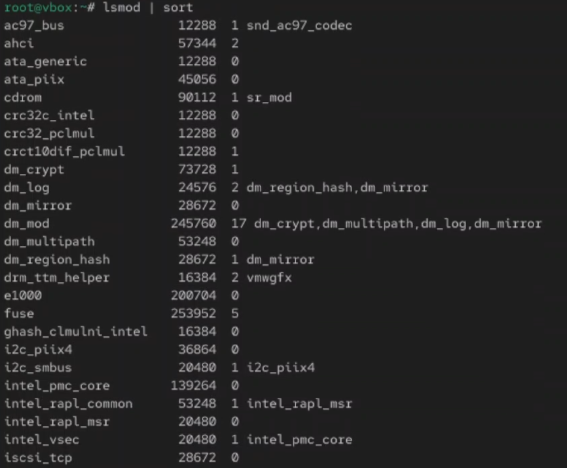{ width=100% }

## Часть 4: Конфигурация модулей

16. **Настройка модулей через modprobe.d**

    Конфигурационные файлы в `/etc/modprobe.d/`:

    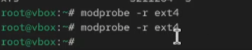{ width=100% }

17. **Загрузка модулей при старте системы**

    Файл `/etc/modules` для автоматической загрузки модулей:

    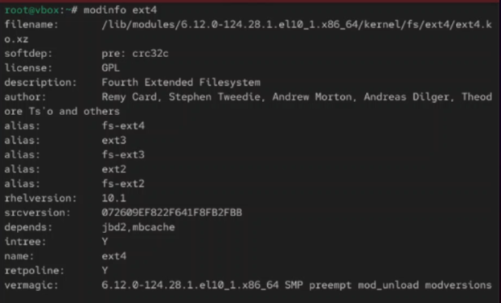{ width=100% }

18. **Черный список модулей**

    Запрет на загрузку определенных модулей:

    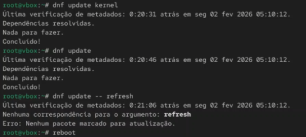{ width=100% }

19. **Сообщения ядра при загрузке модулей**

    Просмотр сообщений ядра при работе с модулями через `dmesg`:

    { width=100% }

# Сравнение команд insmod и modprobe

| Команда | Особенности | Использование |
|---------|-------------|---------------|
| `insmod` | Прямая загрузка, требуется полный путь, нет зависимостей | Для разработки и тестирования |
| `rmmod` | Прямая выгрузка, нет зависимостей | Для простой выгрузки |
| `modprobe` | Умная загрузка с зависимостями, ищет в стандартных директориях | Для повседневного использования |
| `modprobe -r` | Умная выгрузка с зависимостями | Для корректного удаления |
# Основные директории модулей

| Директория | Назначение |
|------------|------------|
| `/lib/modules/$(uname -r)/` | Модули для текущего ядра |
| `/etc/modprobe.d/` | Конфигурация modprobe |
| `/etc/modules` | Автозагрузка модулей |
| `/proc/modules` | Информация о загруженных модулях |

# Вывод

В ходе выполнения лабораторной работы были изучены механизмы управления модулями ядра Linux. Получены практические навыки работы с основными командами: `lsmod` для просмотра загруженных модулей, `modinfo` для получения детальной информации о модулях, `insmod` и `rmmod` для прямой загрузки и выгрузки, `modprobe` для умного управления модулями с учетом зависимостей. Освоены методы работы с конфигурационными файлами в `/etc/modprobe.d/` и настройка автозагрузки модулей через `/etc/modules`. Изучены зависимости между модулями и способы их обновления через `depmod`. Полученные знания позволяют эффективно управлять функциональностью ядра Linux, добавляя и удаляя поддержку оборудования и файловых систем по требованию без необходимости перезагрузки системы.
