## Докладчик

* Лемуш Мариу Франсишку
* Студент группы НПИбд-01-24
* Студ. билет 1032239162
* Российский университет дружбы народов

## Цель работы

- Получить навыки управления дисками и файловыми системами в Linux
- Изучить команды для создания и монтирования файловых систем
- Научиться работать с разделами диска

## Теоретическая справка

**Управление дисками в Linux**

Основные понятия:
- `fdisk` / `parted` — работа с разделами диска
- `mkfs` — создание файловой системы
- `mount` / `umount` — монтирование и размонтирование
- `/etc/fstab` — файл для автоматического монтирования
- `lsblk` — просмотр информации о блочных устройствах

## Просмотр информации о дисках

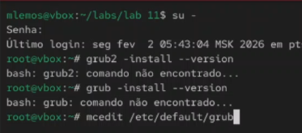

## Просмотр таблицы разделов

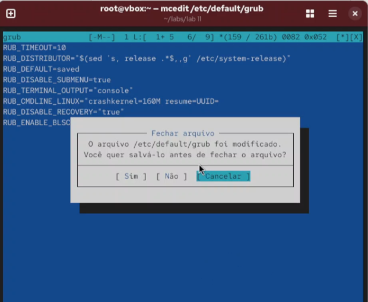

## Запуск fdisk для работы с диском

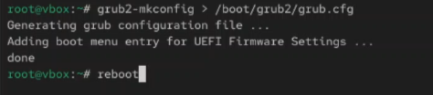

## Создание нового раздела

## Изменение типа раздела

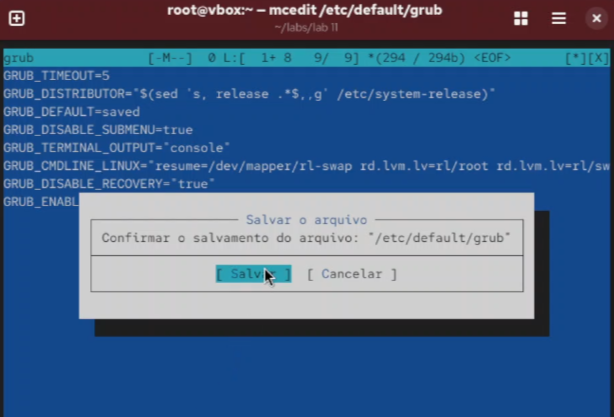

## Сохранение изменений

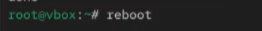

## Создание файловой системы ext4

## Создание точки монтирования

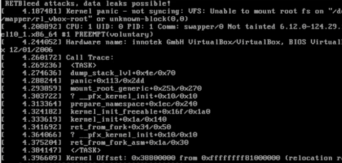

## Монтирование раздела

## Проверка монтирования

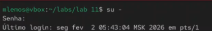

## Добавление записи в /etc/fstab

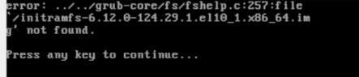

## Проверка монтирования после перезагрузки

## Работа с UUID

## Создание файловой системы XFS

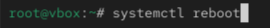

## Сравнение файловых систем

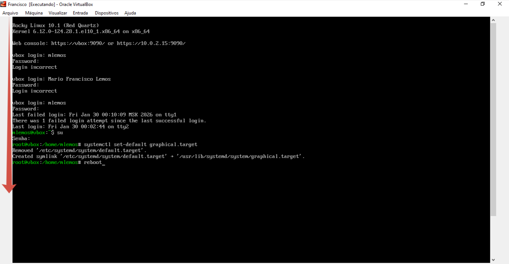

## Размонтирование раздела

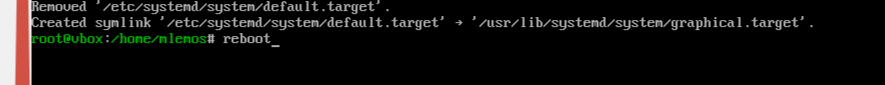

## Вывод

В ходе выполнения лабораторной работы были получены навыки управления дисками и файловыми системами в Linux. Освоены методы создания разделов с помощью fdisk, создания файловых систем (ext4, XFS), монтирования и настройки автоматического монтирования через /etc/fstab.

## Список литературы

[1] Linux man pages: fdisk(8), mkfs(8), mount(8), umount(8), blkid(8), lsblk(8)
