## Докладчик

* Лемуш Мариу Франсишку
* Студент группы НПИбд-01-24
* Студ. билет 1032239162
* Российский университет дружбы народов
## Цель работы

- Изучить основные сетевые параметры в ОС Linux
- Освоить команды для настройки сетевых интерфейсов
- Научиться конфигурировать статические и динамические IP-адреса
- Получить навыки управления сетевыми службами

## Теоретическая справка

**Настройка сети в Linux**

Основные команды:
- `ip addr show` — просмотр IP-адресов
- `ip route show` — просмотр маршрутов
- `nmcli` — управление NetworkManager
- `hostnamectl` — управление именем хоста
- `ping` — проверка доступности узлов

Конфигурационные файлы:
- `/etc/sysconfig/network-scripts/` — настройки интерфейсов (RHEL/Rocky)
- `/etc/resolv.conf` — настройки DNS
- `/etc/hosts` — локальное разрешение имён

## Просмотр всех сетевых интерфейсов

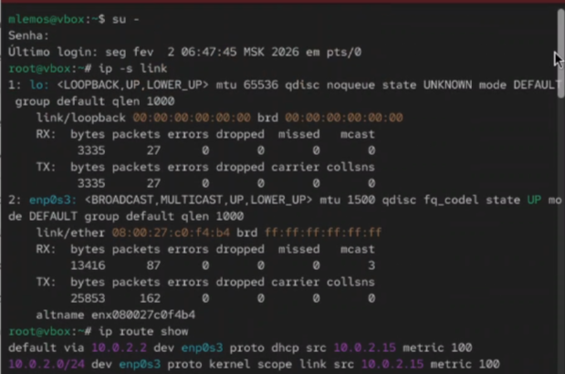

## Просмотр таблицы маршрутизации

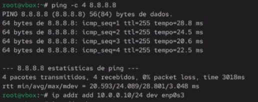

## Просмотр статистики сетевых интерфейсов

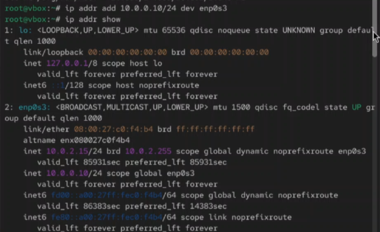

## Просмотр активных сетевых соединений

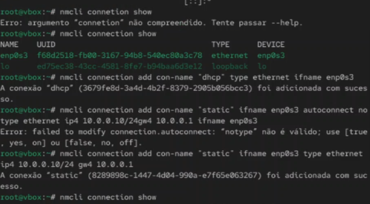

## Просмотр конфигурации DNS

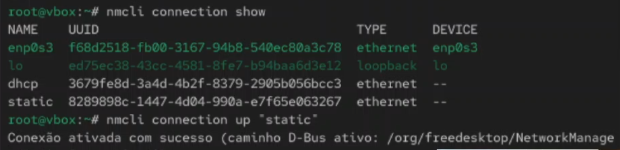

## Просмотр файла hosts

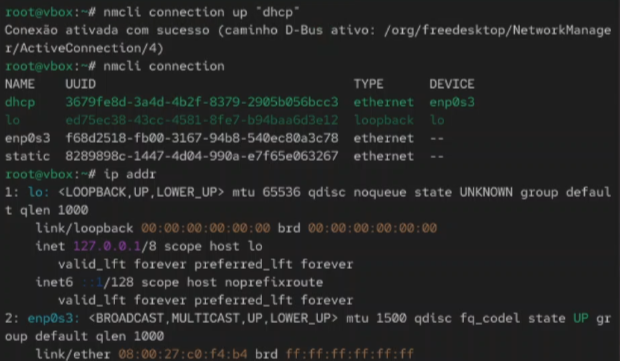

## Конфигурационные файлы интерфейсов

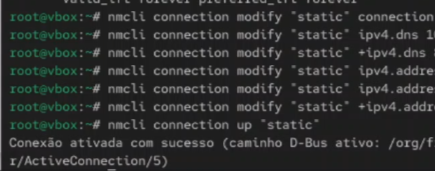

## Настройка статического IP-адреса

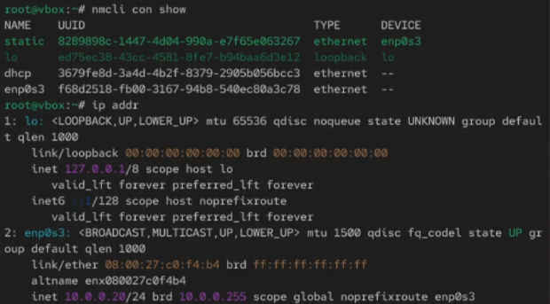

## Настройка динамического IP (DHCP)

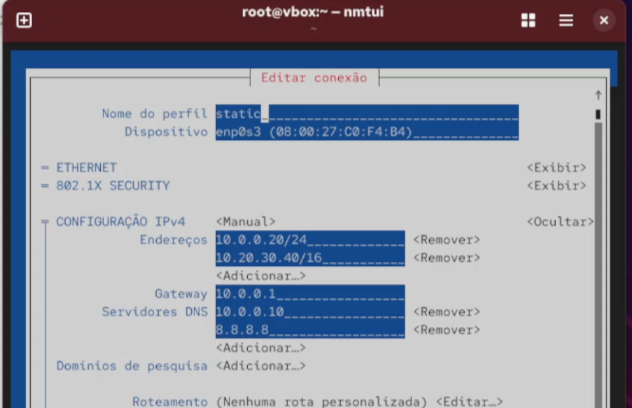

## Применение сетевых настроек

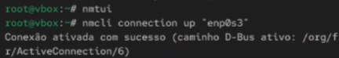

## Управление NetworkManager через nmcli

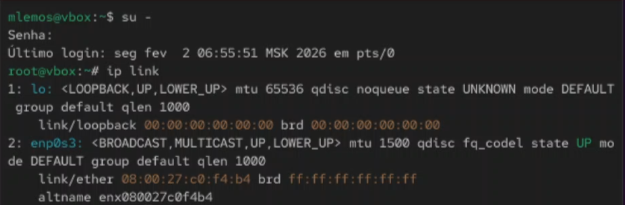

## Настройка соединения через nmcli

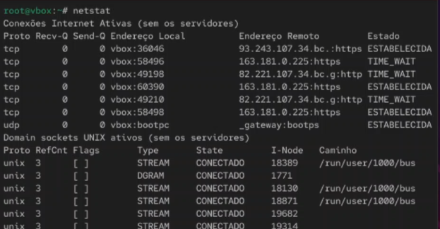

## Текстовый интерфейс nmtui

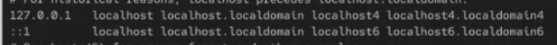

## Управление именем хоста

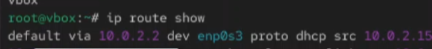

## Проверка сетевой доступности

## Вывод

В ходе выполнения лабораторной работы были изучены основные сетевые параметры в ОС Linux и методы их настройки. Получены практические навыки просмотра сетевых интерфейсов с помощью команд `ip addr`, `ip route`, `ss`. Освоены методы настройки статических и динамических IP-адресов через конфигурационные файлы и с помощью NetworkManager.

## Список литературы

[1] Linux man pages: ip(8), nmcli(1), nmtui(1), hostnamectl(1), ping(8), ss(8)
