# Цель работы

- Изучить архитектуру и компоненты системы фильтрации пакетов в Linux.
- Освоить основные команды для управления firewalld.
- Научиться настраивать зоны, правила и службы.
- Получить навыки работы с богатыми правилами (rich rules).
- Понять структуру конфигурационных файлов firewalld.

# Теоретическое введение

**Firewalld** — это динамический межсетевой экран (файервол), который использует зоны и службы для управления правилами фильтрации пакетов. Он является фронтендом для nftables/iptables и предоставляет более удобный интерфейс для настройки.

## Основные компоненты firewalld:

- **Зоны (zones)** — наборы правил для разных уровней доверия сети
- **Службы (services)** — предопределённые правила для конкретных служб
- **Богатые правила (rich rules)** — сложные правила с дополнительными условиями
- **Прямые правила (direct rules)** — ручное управление iptables/nftables
- **Паника (panic mode)** — режим блокировки всего трафика

## Основные команды firewalld:

- `firewall-cmd` — основная команда для управления firewalld
- `firewall-cmd --get-zones` — список доступных зон
- `firewall-cmd --get-default-zone` — просмотр зоны по умолчанию
- `firewall-cmd --set-default-zone=zone` — установка зоны по умолчанию
- `firewall-cmd --zone=public --add-service=http` — добавление службы
- `firewall-cmd --zone=public --remove-service=http` — удаление службы
- `firewall-cmd --zone=public --add-port=8080/tcp` — открытие порта
- `firewall-cmd --zone=public --remove-port=8080/tcp` — закрытие порта
- `firewall-cmd --list-all` — просмотр всех правил
- `firewall-cmd --reload` — перезагрузка правил
- `firewall-cmd --runtime-to-permanent` — сохранение временных правил

# Выполнение лабораторной работы
## Часть 1: Просмотр информации о firewalld

1. **Проверка статуса firewalld**

   Команда `systemctl status firewalld` показывает состояние службы:

   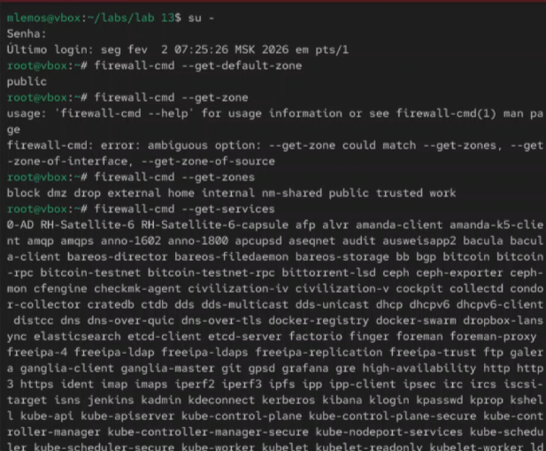{ width=100% }

2. **Просмотр всех доступных зон**

   Команда `firewall-cmd --get-zones` выводит список всех зон:

   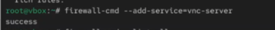{ width=100% }

3. **Просмотр зоны по умолчанию**

   Команда `firewall-cmd --get-default-zone` показывает текущую зону:

   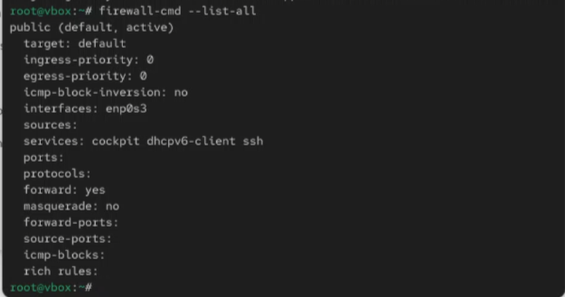{ width=100% }

4. **Детальная информация о зоне по умолчанию**

   Команда `firewall-cmd --zone=public --list-all` показывает все правила зоны:

   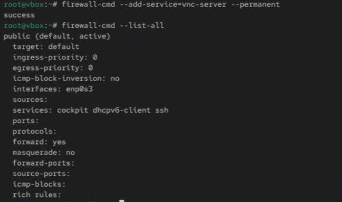{ width=100% }

5. **Просмотр всех активных зон**

   Команда `firewall-cmd --get-active-zones` показывает используемые зоны:

   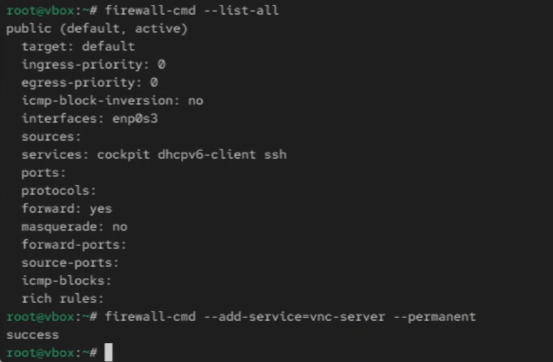{ width=100% }

6. **Просмотр всех доступных служб**

   Команда `firewall-cmd --get-services` выводит список предопределённых служб:

   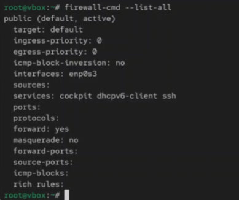{ width=100% }

7. **Просмотр информации о конкретной службе**

   Команда `firewall-cmd --info-service=http` показывает детали службы HTTP:

   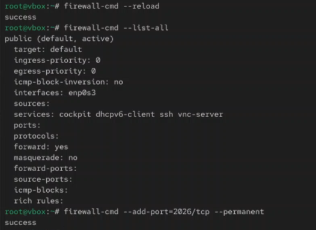{ width=100% }

## Часть 2: Управление зонами

8. **Изменение зоны по умолчанию**

   Команда `firewall-cmd --set-default-zone=internal` меняет зону:

   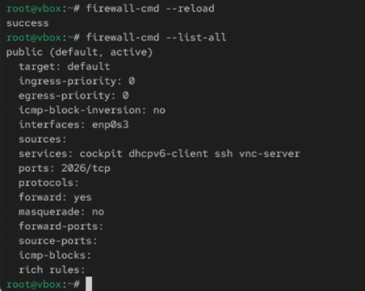{ width=100% }

9. **Добавление интерфейса в зону**

   Команда `firewall-cmd --zone=public --add-interface=eth0`:

   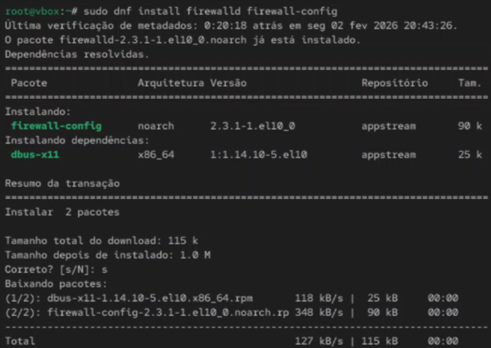{ width=100% }

10. **Изменение зоны для интерфейса**

    Команда `firewall-cmd --zone=internal --change-interface=eth0`:

    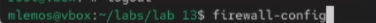{ width=100% }

11. **Удаление интерфейса из зоны**

    Команда `firewall-cmd --zone=public --remove-interface=eth0`:

    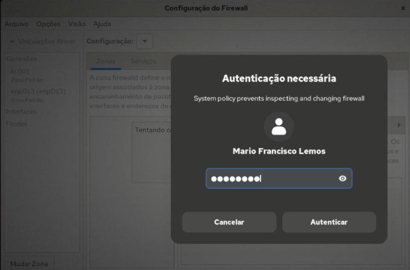{ width=100% }

12. **Просмотр всех правил всех зон**

    Команда `firewall-cmd --list-all-zones` показывает полную конфигурацию:

    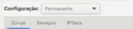{ width=100% }

## Часть 3: Управление службами и портами
13. **Добавление службы в зону**

    Команда `firewall-cmd --zone=public --add-service=http`:

    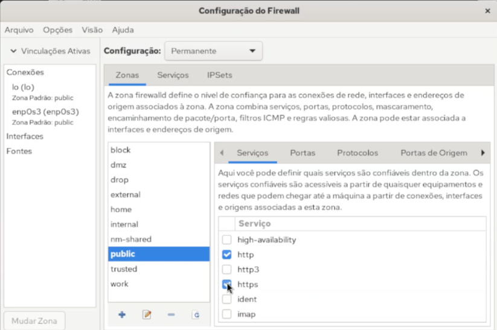{ width=100% }

14. **Добавление нескольких служб**

    Команда `firewall-cmd --zone=public --add-service={http,https,ssh}`:

    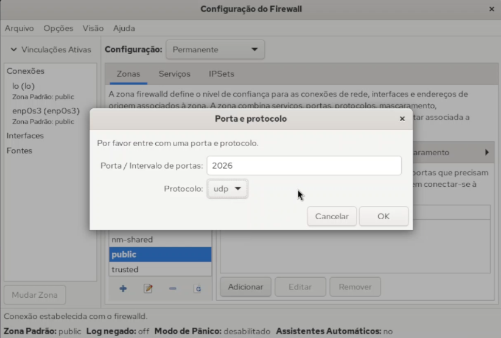{ width=100% }

15. **Удаление службы из зоны**

    Команда `firewall-cmd --zone=public --remove-service=http`:

    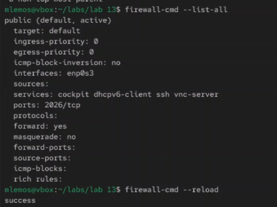{ width=100% }

16. **Открытие конкретного порта**

    Команда `firewall-cmd --zone=public --add-port=8080/tcp`:

    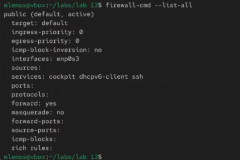{ width=100% }

17. **Открытие диапазона портов**

    Команда `firewall-cmd --zone=public --add-port=8000-9000/tcp`:

    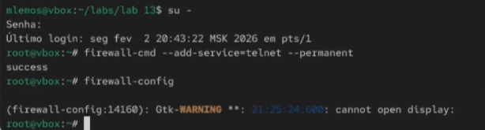{ width=100% }

18. **Закрытие порта**

    Команда `firewall-cmd --zone=public --remove-port=8080/tcp`:

    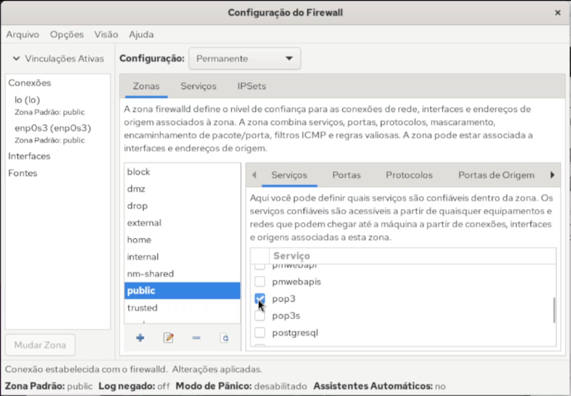{ width=100% }

## Часть 4: Богатые правила и расширенная настройка

19. **Добавление богатого правила для источника**

    Команда `firewall-cmd --zone=public --add-rich-rule='rule family="ipv4" source address="192.168.1.100" accept'`:

    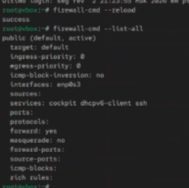{ width=100% }

20. **Добавление богатого правила с ограничением**

    Команда `firewall-cmd --zone=public --add-rich-rule='rule service name="ssh" limit value="2/m" accept'`:

    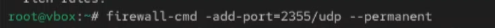{ width=100% }

21. **Добавление богатого правила для протокола**

    Команда `firewall-cmd --zone=public --add-rich-rule='rule protocol value="icmp" accept'`:

    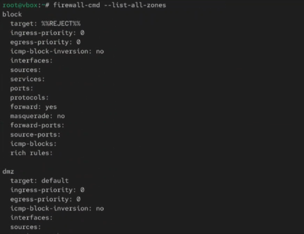{ width=100% }

22. **Просмотр всех богатых правил**

    Команда `firewall-cmd --zone=public --list-rich-rules`:

    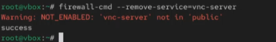{ width=100% }

23. **Перезагрузка и сохранение правил**

    Команды `firewall-cmd --reload` и `firewall-cmd --runtime-to-permanent`:

    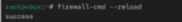{ width=100% }

# Основные зоны firewalld

| Зона | Назначение |
|------|------------|
| `drop` | Все входящие пакеты отбрасываются |
| `block` | Все входящие соединения отклоняются |
| `public` | Для общедоступных сетей (не доверенных) |
| `external` | Для внешних сетей с маскарадингом |
| `internal` | Для внутренних сетей |
| `dmz` | Для компьютеров в демилитаризованной зоне |
| `work` | Для рабочих сетей |
| `home` | Для домашних сетей |
| `trusted` | Все соединения принимаются |

# Основные команды firewalld

| Команда | Назначение |
|---------|------------|
| `firewall-cmd --get-zones` | Список зон |
13. **Добавление службы в зону**

    Команда `firewall-cmd --zone=public --add-service=http`:

    { width=100% }

14. **Добавление нескольких служб**

    Команда `firewall-cmd --zone=public --add-service={http,https,ssh}`:

    { width=100% }

15. **Удаление службы из зоны**

    Команда `firewall-cmd --zone=public --remove-service=http`:

    { width=100% }

16. **Открытие конкретного порта**

    Команда `firewall-cmd --zone=public --add-port=8080/tcp`:

    { width=100% }

17. **Открытие диапазона портов**

    Команда `firewall-cmd --zone=public --add-port=8000-9000/tcp`:

    { width=100% }

18. **Закрытие порта**

    Команда `firewall-cmd --zone=public --remove-port=8080/tcp`:

    { width=100% }

## Часть 4: Богатые правила и расширенная настройка

19. **Добавление богатого правила для источника**

    Команда `firewall-cmd --zone=public --add-rich-rule='rule family="ipv4" source address="192.168.1.100" accept'`:

    { width=100% }

20. **Добавление богатого правила с ограничением**

    Команда `firewall-cmd --zone=public --add-rich-rule='rule service name="ssh" limit value="2/m" accept'`:

    { width=100% }

21. **Добавление богатого правила для протокола**

    Команда `firewall-cmd --zone=public --add-rich-rule='rule protocol value="icmp" accept'`:

    { width=100% }

22. **Просмотр всех богатых правил**

    Команда `firewall-cmd --zone=public --list-rich-rules`:

    { width=100% }

23. **Перезагрузка и сохранение правил**

    Команды `firewall-cmd --reload` и `firewall-cmd --runtime-to-permanent`:

    { width=100% }

# Основные зоны firewalld

| Зона | Назначение |
|------|------------|
| `drop` | Все входящие пакеты отбрасываются |
| `block` | Все входящие соединения отклоняются |
| `public` | Для общедоступных сетей (не доверенных) |
| `external` | Для внешних сетей с маскарадингом |
| `internal` | Для внутренних сетей |
| `dmz` | Для компьютеров в демилитаризованной зоне |
| `work` | Для рабочих сетей |
| `home` | Для домашних сетей |
| `trusted` | Все соединения принимаются |

# Основные команды firewalld| `firewall-cmd --get-default-zone` | Зона по умолчанию |
| `firewall-cmd --set-default-zone=zone` | Установка зоны |
| `firewall-cmd --zone=zone --list-all` | Правила зоны |
| `firewall-cmd --zone=zone --add-service=service` | Добавление службы |
| `firewall-cmd --zone=zone --add-port=port/tcp` | Открытие порта |
| `firewall-cmd --zone=zone --add-rich-rule=rule` | Богатое правило |
| `firewall-cmd --reload` | Перезагрузка |
| `firewall-cmd --runtime-to-permanent` | Сохранение |

# Вывод

В ходе выполнения лабораторной работы была изучена система фильтрации пакетов firewalld в Linux. Получены практические навыки управления зонами, включая просмотр доступных зон с помощью `firewall-cmd --get-zones`, изменение зоны по умолчанию и назначение интерфейсов зонам. Освоены методы добавления и удаления служб и портов, настройки богатых правил для тонкой фильтрации трафика. Изучены возможности сохранения временных правил и перезагрузки конфигурации. Полученные знания позволяют эффективно настраивать межсетевой экран для обеспечения безопасности Linux-систем в различных сетевых средах.
