# Цель работы

- Изучить архитектуру управления дисками в ОС Linux.
- Освоить основные команды для работы с разделами диска.
- Научиться создавать и удалять разделы.
- Получить навыки создания файловых систем.
- Освоить методы монтирования и размонтирования файловых систем.
- Понять структуру таблицы разделов и файла /etc/fstab.

# Теоретическое введение

**Управление дисками в Linux** является фундаментальной задачей системного администрирования. Linux поддерживает различные типы файловых систем и предоставляет мощные инструменты для управления разделами.

## Основные понятия:

- **Раздел диска** — логическая область на физическом диске
- **Таблица разделов** — MBR (Master Boot Record) или GPT (GUID Partition Table)
- **Файловая система** — способ организации данных на разделе
- **Точка монтирования** — директория, через которую осуществляется доступ к файловой системе
- **LVM (Logical Volume Manager)** — менеджер логических томов

## Основные типы файловых систем в Linux:

- **ext2/ext3/ext4** — стандартные файловые системы Linux
- **XFS** — высокопроизводительная файловая система
- **Btrfs** — современная файловая система с расширенными возможностями
- **swap** — раздел подкачки
- **vfat / ntfs** — файловые системы для совместимости с Windows

## Основные команды для работы с дисками:

- `fdisk` / `gdisk` — утилиты для работы с таблицей разделов
- `parted` — расширенная утилита для работы с разделами
- `lsblk` — просмотр информации о блочных устройствах
- `blkid` — просмотр UUID файловых систем
- `mkfs` — создание файловой системы
- `mount` / `umount` — монтирование и размонтирование
- `df` — просмотр информации о смонтированных файловых системах
- `du` — оценка использования дискового пространства
- `fsck` — проверка и восстановление файловой системы
- `swapon` / `swapoff` — включение/отключение раздела подкачки

# Выполнение лабораторной работы

## Часть 1: Просмотр информации о дисках и разделах

1. **Просмотр всех дисков и разделов**

   Команда `lsblk` показывает древовидную структуру всех блочных устройств:

   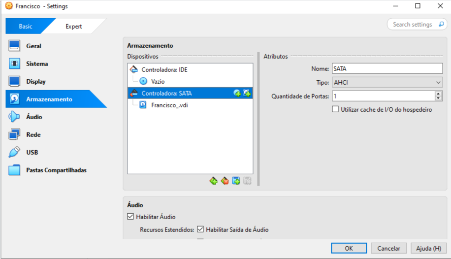{ width=100% }

2. **Детальная информация о дисках**

   Команда `fdisk -l` отображает подробную информацию о всех дисках:

   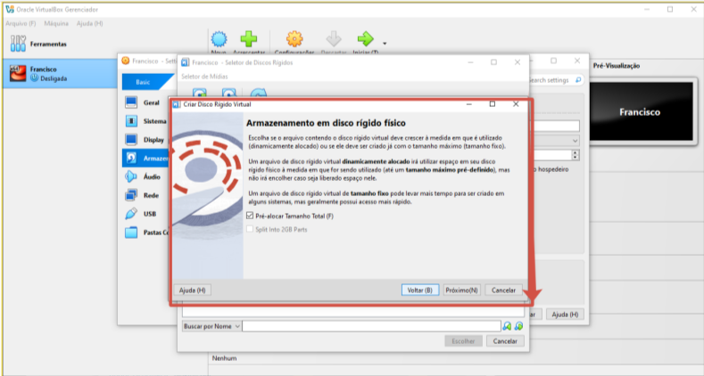{ width=100% }

3. **Просмотр информации о конкретном диске**

   Команда `fdisk -l /dev/sda` для просмотра информации о диске sda:

   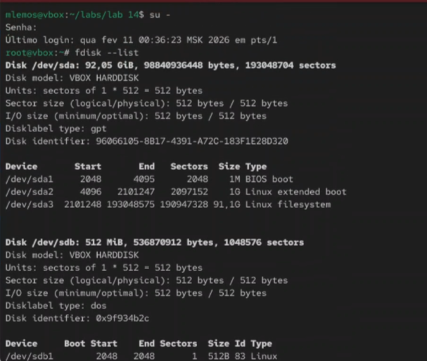{ width=100% }

4. **Просмотр UUID файловых систем**

   Команда `blkid` показывает UUID всех файловых систем:

   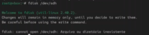{ width=100% }

5. **Просмотр смонтированных файловых систем**

   Команда `df -h` показывает использование дискового пространства:

   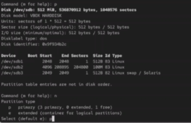{ width=100% }

6. **Просмотр информации о inode**

   Команда `df -i` показывает использование inode:

   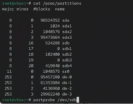{ width=100% }

7. **Просмотр информации о дисках в /proc**

   Файл `/proc/partitions` содержит информацию о разделах:

   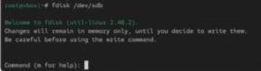{ width=100% }

8. **Просмотр информации о дисках в /sys**

   Директория `/sys/block/` содержит информацию о блочных устройствах:

   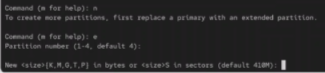{ width=100% }

## Часть 2: Работа с таблицей разделов (fdisk)

9. **Запуск fdisk для диска**

   Команда `fdisk /dev/sdb` для начала работы с диском:

   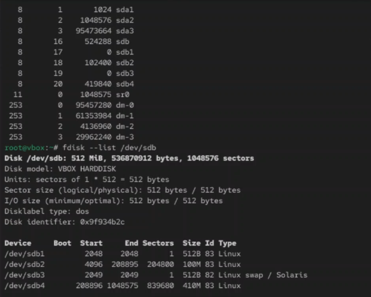{ width=100% }

10. **Просмотр текущей таблицы разделов в fdisk**

    Команда `p` внутри fdisk показывает текущие разделы:

    { width=100% }

11. **Создание нового раздела**

    Команда `n` внутри fdisk для создания нового раздела:

    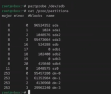{ width=100% }

12. **Выбор типа раздела (primary/extended)**

    Выбор первичного раздела при создании:

    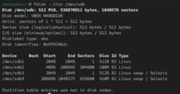{ width=100% }

13. **Указание номера раздела**

    Выбор номера создаваемого раздела:

    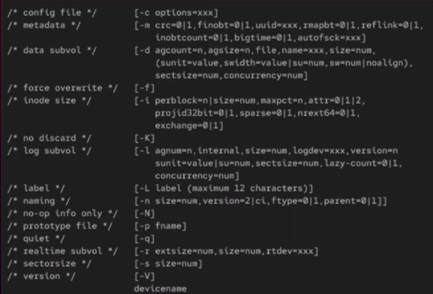{ width=100% }

14. **Указание первого сектора**

    Определение начального сектора раздела:

    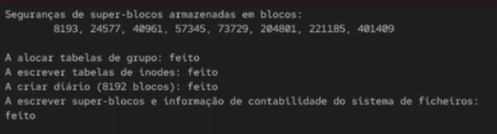{ width=100% }

15. **Указание последнего сектора (размера)**

    Определение размера создаваемого раздела:

    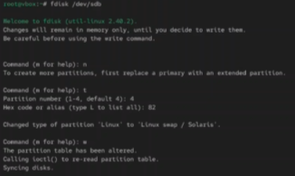{ width=100% }

16. **Изменение типа раздела**

    Команда `t` внутри fdisk для изменения типа раздела:

    { width=100% }

17. **Выбор кода типа раздела**

    Установка типа раздела (Linux, swap и т.д.):

    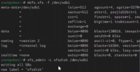{ width=100% }

18. **Просмотр типов разделов**

    Команда `l` внутри fdisk для просмотра всех типов:

    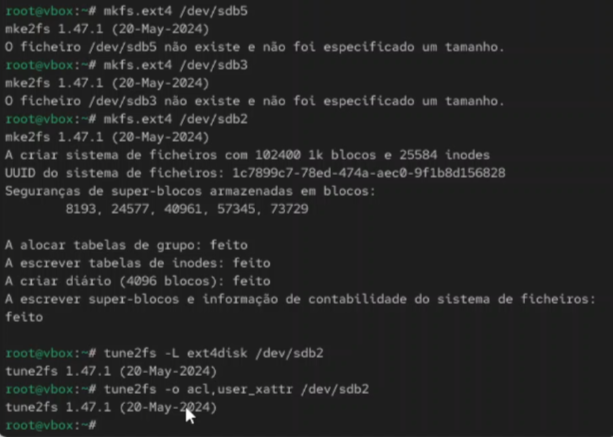{ width=100% }

19. **Удаление раздела**

    Команда `d` внутри fdisk для удаления раздела:

    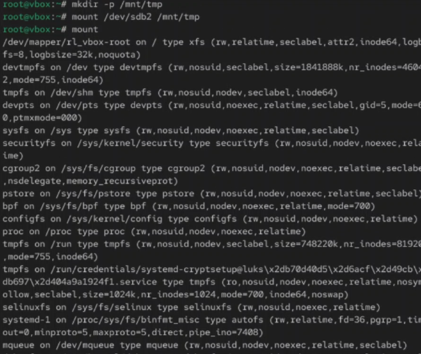{ width=100% }

20. **Сохранение изменений**

    Команда `w` внутри fdisk для записи изменений:

    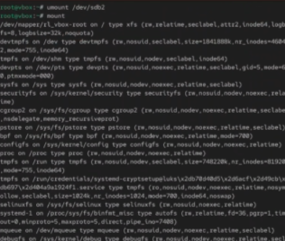{ width=100% }

21. **Выход без сохранения**

    Команда `q` внутри fdisk для выхода без сохранения:

    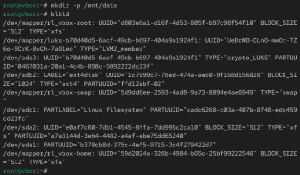{ width=100% }
## Часть 3: Работа с parted

22. **Запуск parted для диска**

    Команда `parted /dev/sdb` для работы с parted:

    { width=100% }

23. **Просмотр таблицы разделов в parted**

    Команда `print` внутри parted показывает разделы:

    { width=100% }

24. **Создание таблицы разделов GPT**

    Команда `mklabel gpt` для создания GPT:

    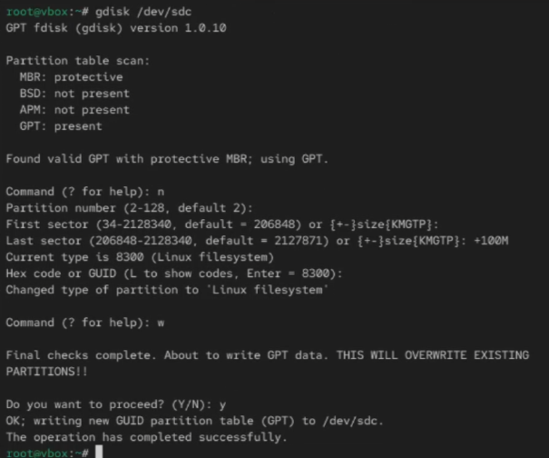{ width=100% }

25. **Создание раздела в parted**

    Команда `mkpart` для создания раздела:

    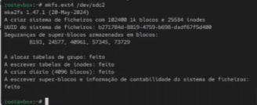{ width=100% }

## Часть 4: Создание файловых систем

26. **Создание файловой системы ext4**

    Команда `mkfs.ext4 /dev/sdb1` для создания ext4:

    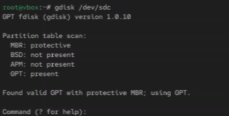{ width=100% }

27. **Создание файловой системы XFS**

    Команда `mkfs.xfs /dev/sdb2` для создания XFS:

    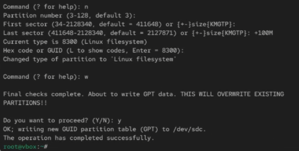{ width=100% }

28. **Создание раздела подкачки (swap)**

    Команда `mkswap /dev/sdb3` для создания swap:

    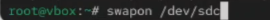{ width=100% }

29. **Создание файловой системы ext3**

    Команда `mkfs.ext3 /dev/sdb4` для создания ext3:

    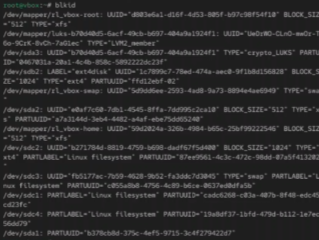{ width=100% }

30. **Создание файловой системы с меткой**

    Команда `mkfs.ext4 -L mydata /dev/sdb5` с меткой:

    { width=100% }

## Часть 5: Монтирование файловых систем

31. **Ручное монтирование раздела**

    Команда `mount /dev/sdb1 /mnt/data` для монтирования:

    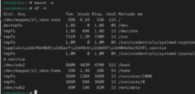{ width=100% }

32. **Просмотр смонтированных файловых систем**

    Команда `mount` без параметров показывает все монтирования:

    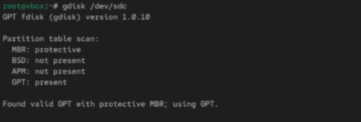{ width=100% }

33. **Монтирование по UUID**

    Команда `mount UUID="xxxx" /mnt/data` для монтирования по UUID:

    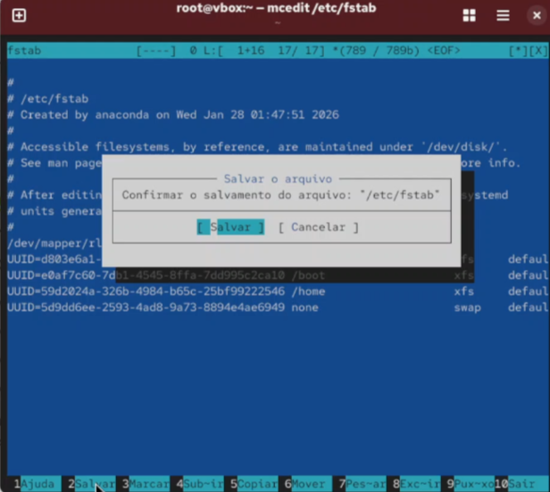{ width=100% }

34. **Монтирование с опциями**

    Команда `mount -o noexec,nosuid /dev/sdb1 /mnt/data`:

    { width=100% }

35. **Размонтирование раздела**

    Команда `umount /mnt/data` для размонтирования:

    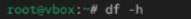{ width=100% }

36. **Принудительное размонтирование**

    Команда `umount -l /mnt/data` (ленивое размонтирование):

    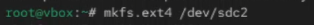{ width=100% }

## Часть 6: Автоматическое монтирование (/etc/fstab)

37. **Просмотр файла /etc/fstab**

    Файл `/etc/fstab` содержит настройки автоматического монтирования:

    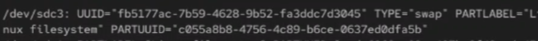{ width=100% }

38. **Добавление записи в /etc/fstab**

    Добавление строки для автоматического монтирования:

    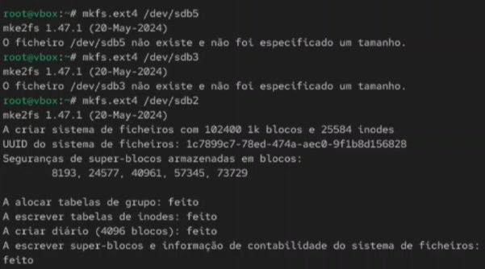{ width=100% }

39. **Проверка монтирования всех файловых систем**

    Команда `mount -a` монтирует всё из /etc/fstab:

    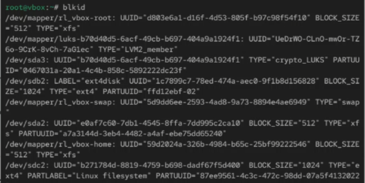{ width=100% }

# Основные типы файловых систем

| Тип | Назначение | Команда создания |
|-----|------------|------------------|
| ext4 | Стандартная ФС Linux | `mkfs.ext4` |
| xfs | Высокопроизводительная ФС | `mkfs.xfs` |
| btrfs | Современная ФС с расширенными возможностями | `mkfs.btrfs` |
| swap | Раздел подкачки | `mkswap` |
| vfat | Для совместимости с Windows | `mkfs.vfat` |
| ntfs | Для совместимости с Windows NT | `mkfs.ntfs` |

# Основные команды для работы с дисками

| Команда | Назначение |
|---------|------------|
| `lsblk` | Просмотр блочных устройств |
| `fdisk -l` | Просмотр разделов |
| `fdisk /dev/sdX` | Работа с разделами |
| `parted /dev/sdX` | Работа с разделами (расширенная) |
| `mkfs.ext4 /dev/sdX1` | Создание ext4 |
| `mount /dev/sdX1 /mnt` | Монтирование |
| `umount /mnt` | Размонтирование |
| `blkid` | Просмотр UUID |
| `df -h` | Использование диска |
| `fsck /dev/sdX1` | Проверка ФС |

# Вывод

В ходе выполнения лабораторной работы были изучены методы управления дисками, разделами и файловыми системами в ОС Linux. Получены практические навыки просмотра информации о дисках с помощью команд `lsblk`, `fdisk -l`, `blkid`. Освоены методы создания и удаления разделов с использованием `fdisk` и `parted`, включая работу с различными типами таблиц разделов (MBR, GPT). Изучены процессы создания файловых систем различных типов (`ext4`, `xfs`, `swap`) с помощью команд `mkfs`. Получены навыки ручного и автоматического монтирования файловых систем через `mount` и настройки `/etc/fstab`. Полученные знания позволяют эффективно управлять дисковым пространством, создавать и настраивать файловые системы для различных задач администрирования Linux-систем.
