# Цель работы

- Изучить архитектуру и компоненты LVM (Logical Volume Manager).
- Освоить основные команды для управления физическими томами.
- Научиться создавать и управлять группами томов.
- Получить навыки создания и изменения логических томов.
- Освоить методы расширения логических томов.
- Понять преимущества LVM перед традиционными разделами.

# Теоретическое введение

**LVM (Logical Volume Manager)** — это менеджер логических томов, который предоставляет гибкое управление дисковым пространством. LVM позволяет создавать логические тома, которые могут быть легко изменены в размере, перемещены между физическими дисками и объединены в группы.

## Компоненты LVM:

- **Физический том (Physical Volume, PV)** — физический диск или раздел, инициализированный для LVM
- **Группа томов (Volume Group, VG)** — объединение физических томов в единое хранилище
- **Логический том (Logical Volume, LV)** — виртуальный раздел, созданный из группы томов
- **Физический экстент (Physical Extent, PE)** — минимальная единица пространства в LVM

## Основные команды LVM:

- `pvcreate` — создание физического тома
- `pvdisplay` / `pvs` — просмотр информации о физических томах
- `vgcreate` — создание группы томов
- `vgdisplay` / `vgs` — просмотр информации о группах томов
- `lvcreate` — создание логического тома
- `lvdisplay` / `lvs` — просмотр информации о логических томах
- `lvextend` — расширение логического тома
- `vgextend` — добавление физического тома в группу

# Выполнение лабораторной работы

## Часть 1: Просмотр информации о LVM

1. **Просмотр всех физических томов**

   Команда `pvs` показывает краткую информацию о физических томах:

   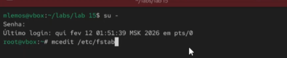{ width=100% }

2. **Детальная информация о физических томах**

   Команда `pvdisplay` отображает подробную информацию о PV:

   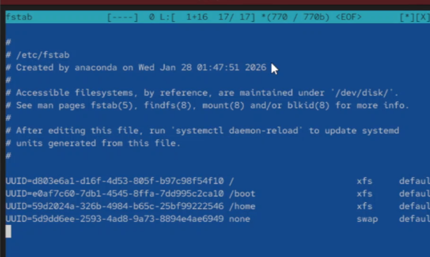{ width=100% }

3. **Просмотр всех групп томов**

   Команда `vgs` показывает краткую информацию о группах томов:

   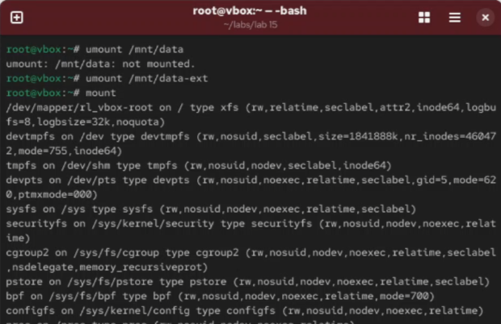{ width=100% }

4. **Детальная информация о группах томов**

   Команда `vgdisplay` отображает подробную информацию о VG:

   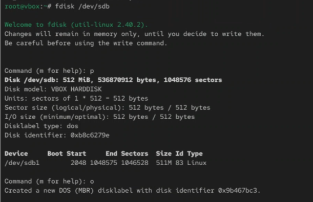{ width=100% }

5. **Просмотр всех логических томов**

   Команда `lvs` показывает краткую информацию о логических томах:

   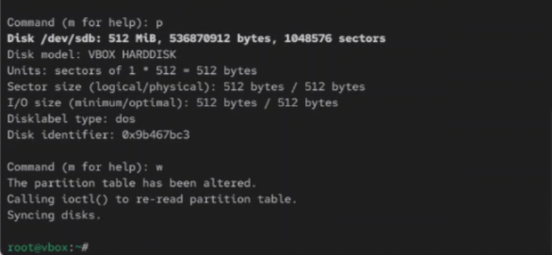{ width=100% }

6. **Детальная информация о логических томах**

   Команда `lvdisplay` отображает подробную информацию о LV:

   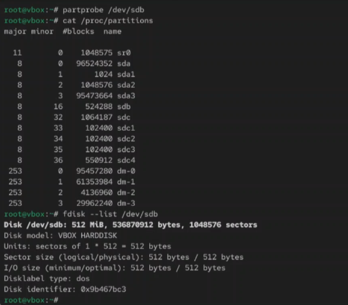{ width=100% }

7. **Просмотр структуры LVM**

   Команда `lsblk` с древовидной структурой показывает LVM:

   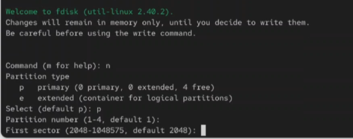{ width=100% }

## Часть 2: Создание физических томов

8. **Инициализация диска как физического тома**

   Команда `pvcreate /dev/sdb` для создания физического тома:

   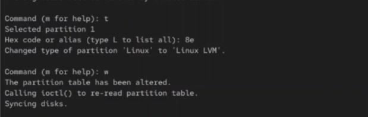{ width=100% }

9. **Инициализация раздела как физического тома**

   Команда `pvcreate /dev/sdc1 /dev/sdc2` для разделов:

   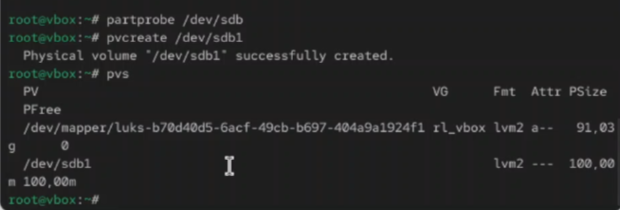{ width=100% }

10. **Просмотр после создания физических томов**

    Команда `pvs` для проверки созданных PV:

    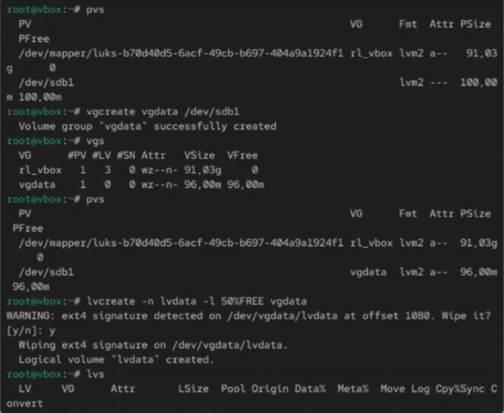{ width=100% }

## Часть 3: Управление группами томов

11. **Создание группы томов**

    Команда `vgcreate vg_data /dev/sdb /dev/sdc` для создания VG:

    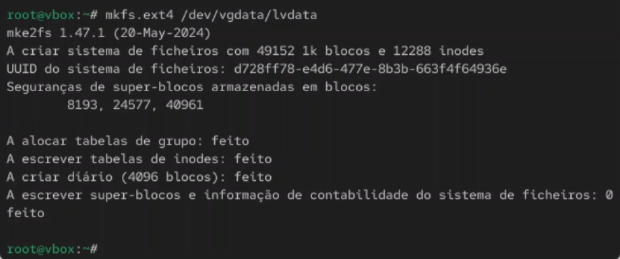{ width=100% }

12. **Добавление физического тома в группу**

    Команда `vgextend vg_data /dev/sdd` для расширения VG:

    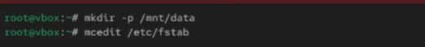{ width=100% }

13. **Просмотр информации о группе томов**

    Команда `vgdisplay vg_data` для детальной информации:

    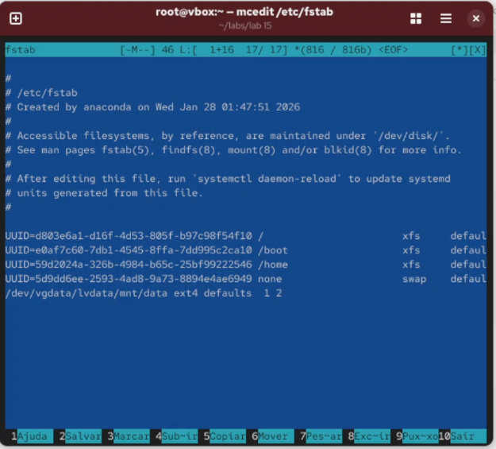{ width=100% }

## Часть 4: Управление логическими томами

14. **Создание логического тома**

    Команда `lvcreate -L 10G -n lv_data vg_data` для создания LV:

    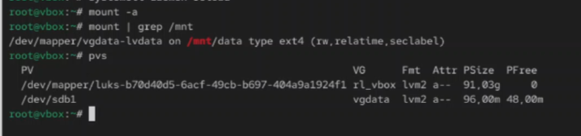{ width=100% }

15. **Создание логического тома с использованием всех экстентов**

    Команда `lvcreate -l 100%FREE -n lv_backup vg_data`:

    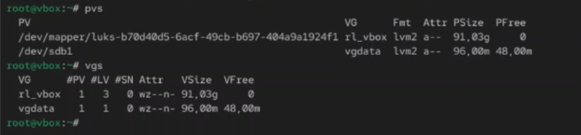{ width=100% }

16. **Просмотр информации о логическом томе**

    Команда `lvdisplay vg_data/lv_data` для детальной информации:

    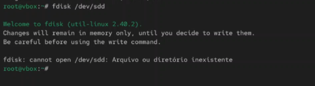{ width=100% }

17. **Форматирование логического тома**

    Команда `mkfs.ext4 /dev/vg_data/lv_data` для создания ФС:

    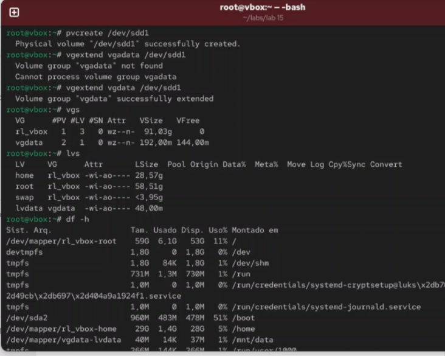{ width=100% }

18. **Монтирование логического тома**

    Команда `mount /dev/vg_data/lv_data /mnt/data` для монтирования:

    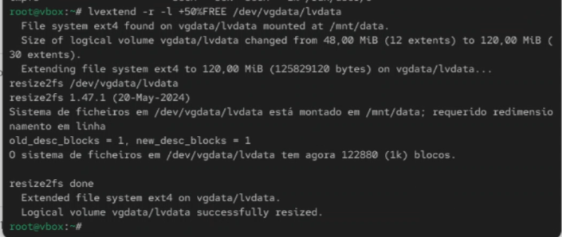{ width=100% }

## Часть 5: Изменение размеров логических томов

19. **Расширение логического тома**

    Команда `lvextend -L +5G /dev/vg_data/lv_data` для увеличения:

    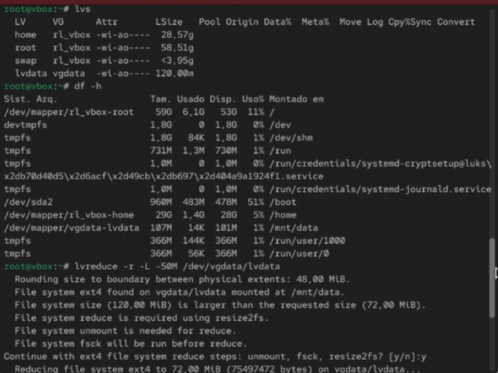{ width=100% }

20. **Расширение логического тома с использованием всех экстентов**

    Команда `lvextend -l +100%FREE /dev/vg_data/lv_data`:

    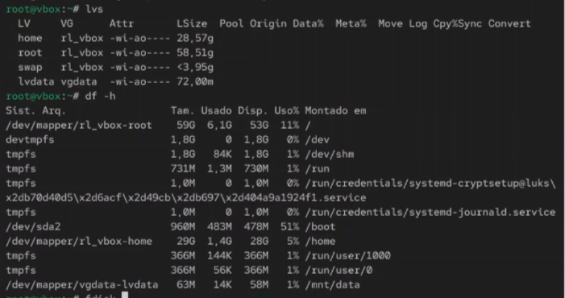{ width=100% }

21. **Изменение размера файловой системы после расширения**

    Команда `resize2fs /dev/vg_data/lv_data` для ext4:

    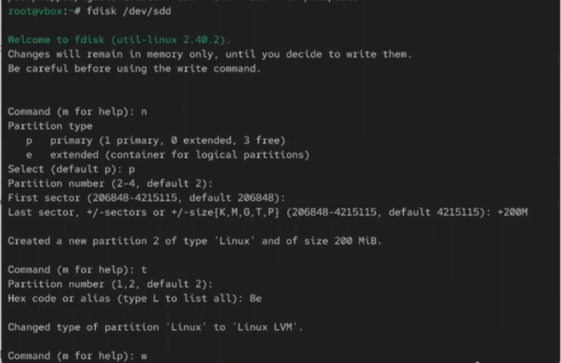{ width=100% }

## Часть 6: Снапшоты и удаление

22. **Создание снапшота логического тома**

    Команда `lvcreate -L 2G -s -n lv_data_snap /dev/vg_data/lv_data`:

    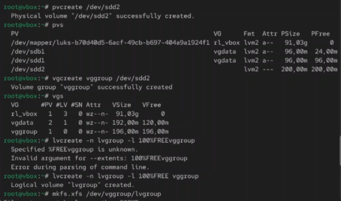{ width=100% }

23. **Удаление логического тома**

    Команда `lvremove /dev/vg_data/lv_data` для удаления LV:

    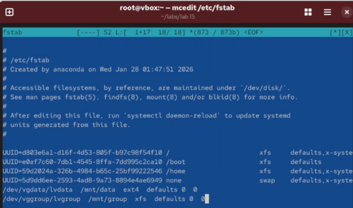{ width=100% }

# Основные команды LVM

| Команда | Назначение |
|---------|------------|
| `pvcreate` | Создание физического тома |
| `pvdisplay` / `pvs` | Просмотр физических томов |
| `vgcreate` | Создание группы томов |
| `vgdisplay` / `vgs` | Просмотр групп томов |
| `lvcreate` | Создание логического тома |
| `lvdisplay` / `lvs` | Просмотр логических томов |
| `lvextend` | Расширение логического тома |
| `vgextend` | Добавление PV в VG |
| `resize2fs` | Изменение размера ФС ext4 |

# Вывод

В ходе выполнения лабораторной работы была изучена система управления логическими томами LVM в Linux. Получены практические навыки создания физических томов с помощью `pvcreate`, управления группами томов через `vgcreate` и `vgextend`, создания логических томов с помощью `lvcreate`. Освоены методы расширения логических томов с использованием `lvextend` и изменения размера файловых систем после расширения. Изучены возможности создания снапшотов для резервного копирования. Полученные знания позволяют эффективно управлять дисковым пространством в Linux-системах, обеспечивая гибкость хранения данных.
