## Докладчик

* Лемуш Мариу Франсишку
* Студент группы НПИбд-01-24
* Студ. билет 1032239162
* Российский университет дружбы народов

## Цель работы

- Освоить работу с RAID-массивами при помощи утилиты mdadm
- Изучить создание различных уровней RAID
- Научиться имитировать сбои и восстанавливать массивы
- Получить навыки работы с горячим резервом (hotspare)

## Теоретическая справка

**Программный RAID в Linux**

Уровни RAID:
- RAID 0 — чередование (striping), повышенная производительность
- RAID 1 — зеркалирование (mirroring), отказоустойчивость
- RAID 5 — чередование с чётностью, отказоустойчивость
- RAID 10 — комбинация зеркалирования и чередования

Утилита mdadm:
- `mdadm --create` — создание RAID-массива
- `mdadm --detail` — информация о массиве
- `mdadm --manage --fail` — имитация сбоя
- `cat /proc/mdstat` — просмотр состояния

## Добавление дисков к виртуальной машине

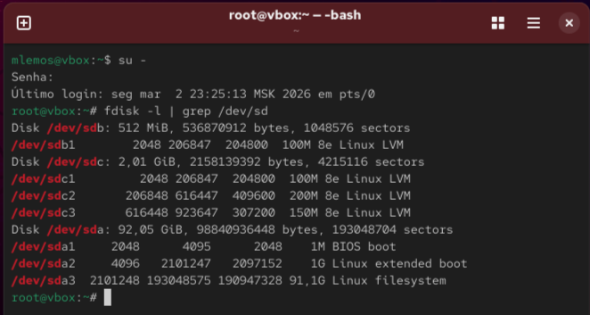

## Проверка создания дисков

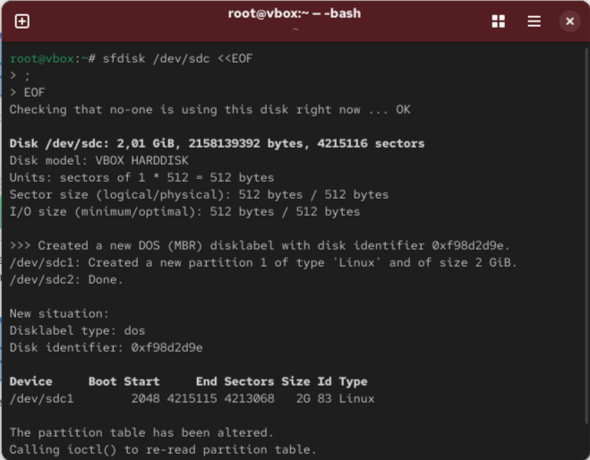

## Создание раздела на диске sdd

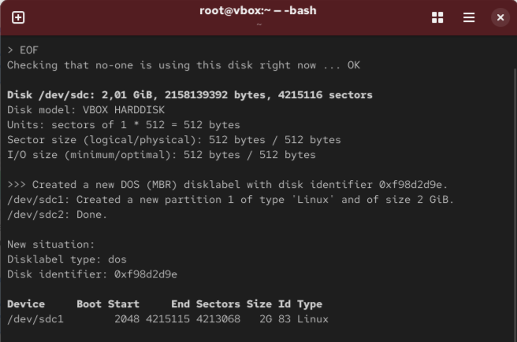

## Создание раздела на диске sde

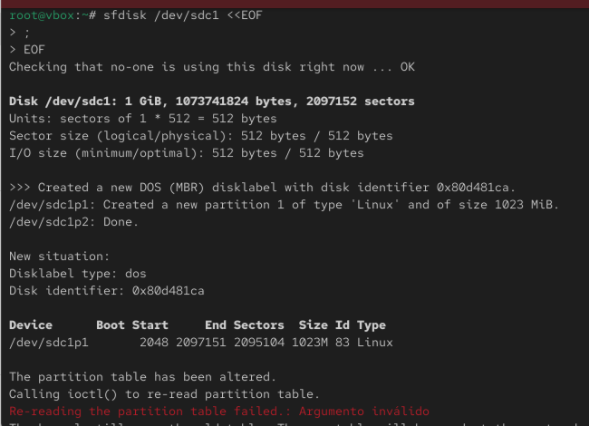

## Создание раздела на диске sdf

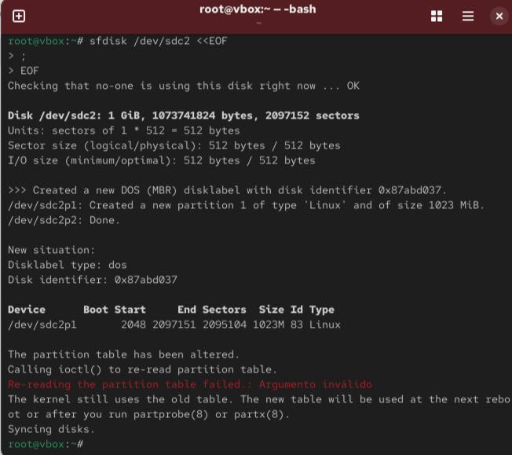

## Проверка типа созданных разделов

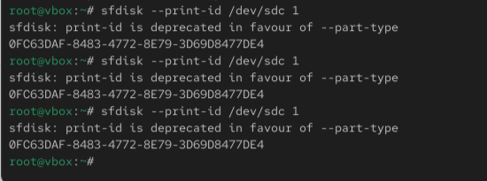

## Установка типа RAID

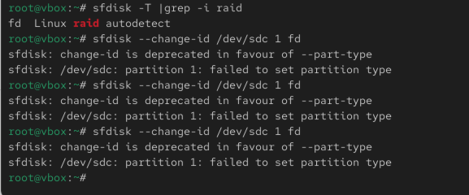

## Создание массива RAID 1

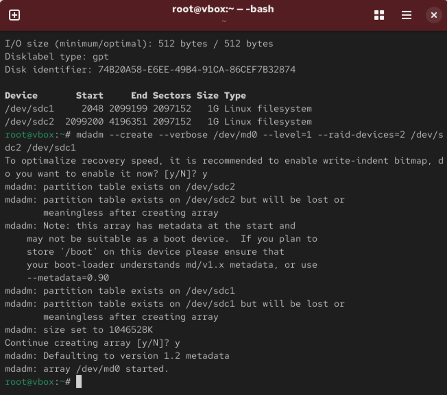

## Проверка состояния массива (cat /proc/mdstat)

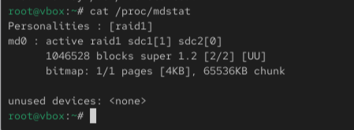

## Проверка состояния массива (mdadm --query)

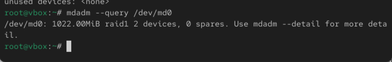

## Проверка состояния массива (mdadm --detail)

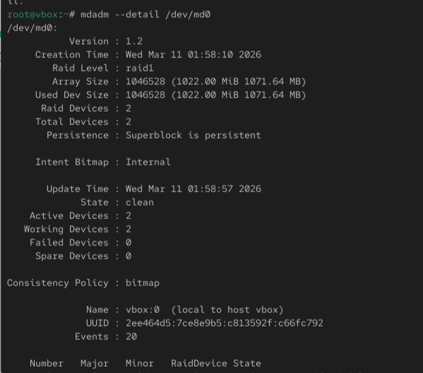

## Создание файловой системы на RAID

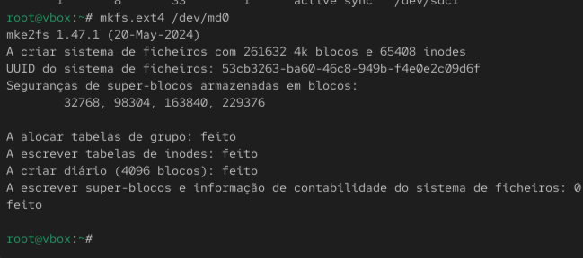

## Подмонтирование RAID

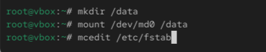

## Добавление записи для автомонтирования

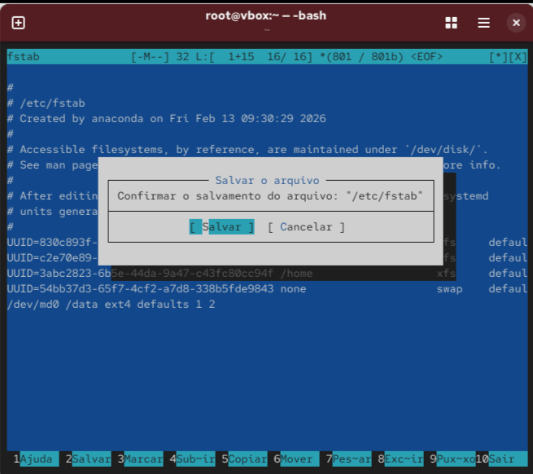

## Имитация сбоя диска

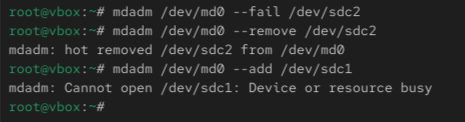

## Просмотр состояния после сбоя

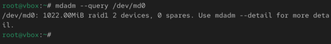

## Детальный просмотр после восстановления

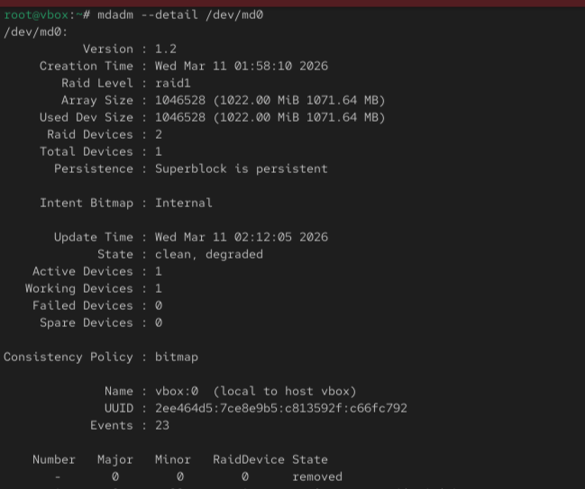

## Удаление массива и очистка метаданных

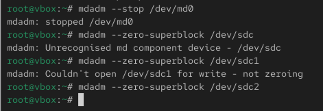

## Создание RAID с горячим резервом

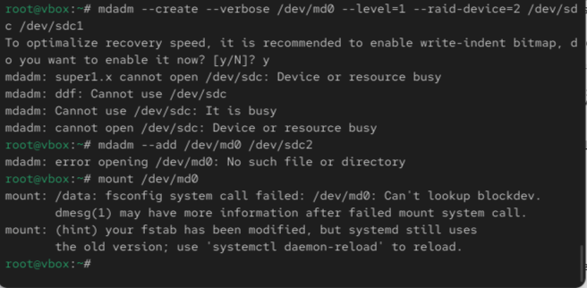

## Проверка состояния с горячим резервом

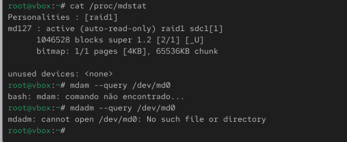

## Итоговая проверка RAID

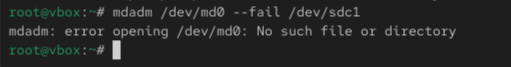

## Вывод

В ходе выполнения лабораторной работы были освоены методы работы с программными RAID-массивами в Linux с использованием утилиты mdadm. Получены практические навыки создания RAID 1, имитации сбоев дисков, восстановления массива, работы с горячим резервом (hotspare), а также настройки автоматического монтирования RAID-массивов.

## Список литературы

[1] Linux man pages: mdadm(8), md(4), /proc/mdstat
